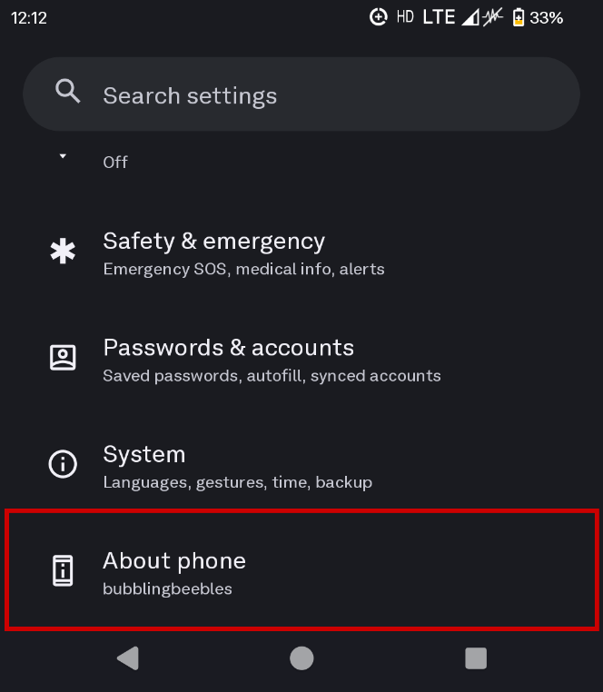
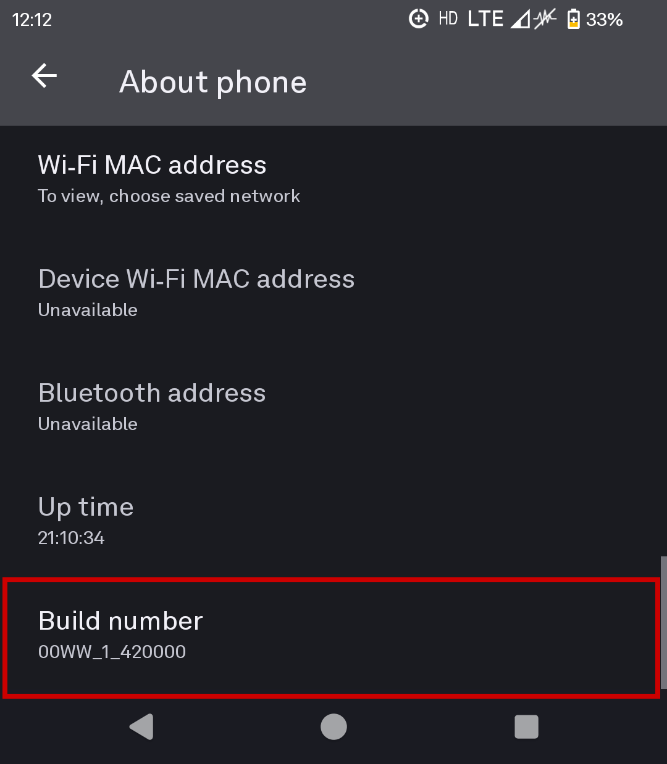
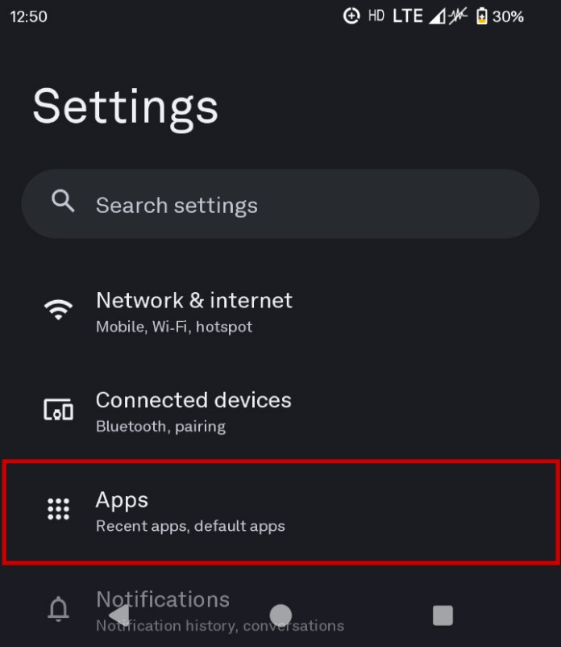
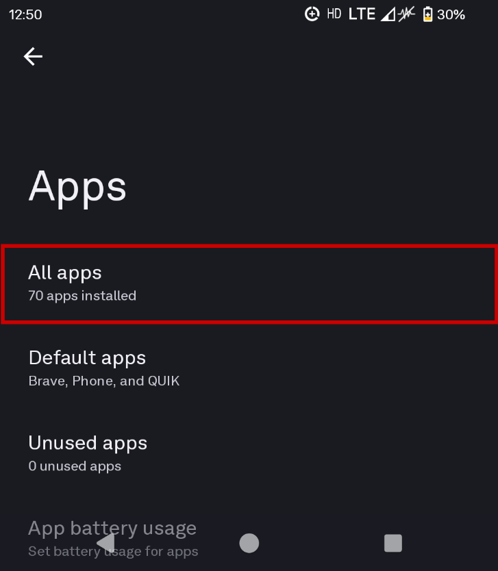
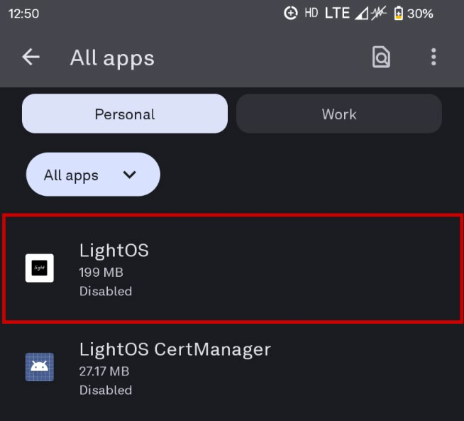
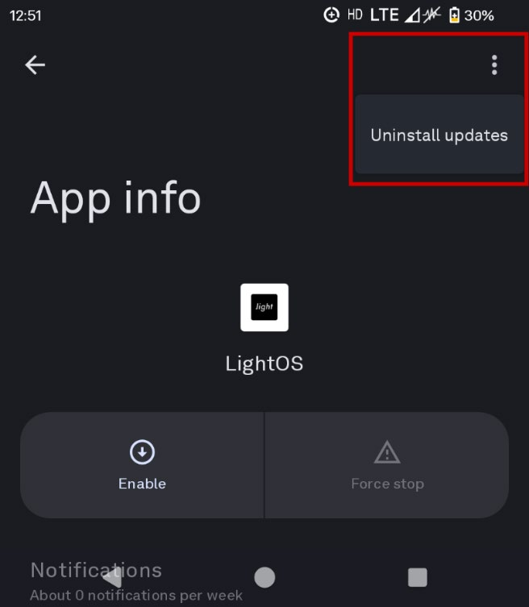
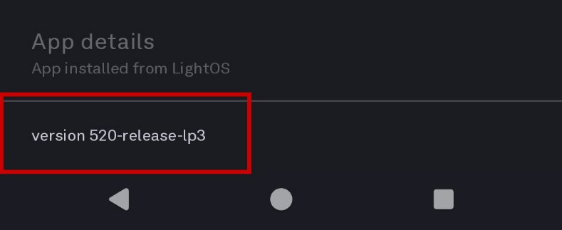
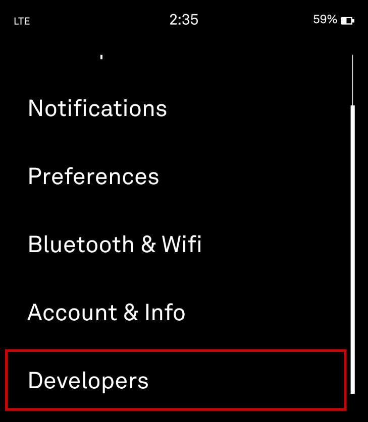

There are two different developer options, one in LightOS and one in Android. They both have different ways of accessing them.

Android developer options will give you more access to side-loading and installing applications or granting permissions to applications.

LightOS developer options will give you access to the entire 'tools' list including Beta 'tools' without connecting a Light Account to access them. This is also how you can disable `light_mode`, and Change Launcher is covered **[HERE](../full-android/#global-setting-light_mode)**.

# Android

```
Settings > 'About Phone' > 'Build Number'
```



1. In Settings, you will navigate all the way down to the bottom of the screen where it says 'About Phone'.

    

2. Navigate to the bottom of the screen again to find 'Build Number'.

    

3. Tap the build number seven (7) times. You will then receive a prompt at the bottom of the screen confirming developer options are enabled.
4. To locate developer options in the future:
    - Search with keywords using the search bar in Settings.
    - Locate it in System > 'Developer Options'



> [!NOTE]
> The [original modding guide](https://docs.google.com/document/d/1aDvuVqibzC8x0FpuHaJw5llYmERLgU8CwcEHg9hHZqc/edit?tab=t.0#heading=h.wb5q0wyzm1wb) makes mention of 'OEM Unlocking' as something to enable after enabling developer options. This is not necessary for the majority of people and will only open the phone up to potential security risks. When the bootloader is unlocked or a root is achieved, this can then be used, but until then there is no need to enable this setting.

# LightOS

## In Android Settings

> [!NOTE]
> **Update:** following the release of the SDK, another option to enable LightOS Developer Options was released to the public.



1. Open the 'Phone' tool in LightOS.
2. Dial `*7412369#` and place the call.
3. This will enable/disable developer mode in LightOS.



---

> [!WARNING]
> The method below no longer works. As of [Firmware v.1.440000](https://support.thelightphone.com/hc/en-us/articles/360031105751-Software-Versions-Change-Log), the factory version is reverted to v52x or higher and the prior key combination no longer works. It is kept here for reference. You can still access Android and opt for 'Full Android' — and all it has to offer — without enabling LightOS Developer Options.

> [!NOTE]
> This will factory reset the LightOS app. Any Light Account information will be deleted as well as any software updates that may be on the phone. Any data such as contacts, call logs, texts, photos or music that is stored locally on the phone can still be accessed after this.

If you are performing this step later on after enabling Hybrid / Full Android Mode, make sure your default applications are all set to LightOS prior to enabling developer options on the LightOS side. Changing default applications can be found [HERE](../setting-up-android/#default-applications).

```
Settings > Apps > 'All Apps' > 'LightOS' > 'Uninstall Updates'
```



1. Navigate to 'Apps'.

    

2. Navigate to 'All Apps'.

    

3. Find and select 'LightOS'.

    

4. Tap the 3 vertical dots at the top right-hand corner of the screen and select 'Uninstall Updates'. Confirm following prompts.

    

5. Verify the version of the LightOS app. It should say v4xx (likely v466). If it shows v52x or higher, **you will not be able to enable LightOS developer options.**

    



## In LightOS

> [!WARNING]
> This method no longer works and is kept here for reference.



1. Prior to opening LightOS, verify your phone is connected to Wi-Fi and reboot it.
2. When opening LightOS, you will be met with the initial phone set-up screen. Do NOT accept anything at this point.
3. With 'UP' referring to the VOLUME UP button and 'DOWN' referring to the VOLUME DOWN button, perform the following key sequence: `DOWN DOWN UP UP DOWN UP HOME`
    - If you have a case on the phone, I would highly recommend taking it off so you are able to perform the key sequence accurately and correctly.
    - You'll need to perform the key sequence quite quickly and it may take a few tries.
4. If done correctly, you will get a brief splash screen stating 'developer options enabled'.
5. You can now proceed through the initial phone set-up and update the phone. The developer options will persist through updates so you don't need to worry about them disappearing when updating the phone.

    


