Per the request of the community, I have also included a few other guides in here, should you wish to use them. Some of these were created by me, but also community contributions.

# Disabling 5G

This section is specific to North America, but the premise is largely the same regardless of which country you're in.

## What is 5G/NR?

5G/NR (new radio) is a fairly new type of network technology started in 2019. It is built on top of the existing 4G/LTE network that came around in the beginning of the 2010s. 4G/LTE is still used widely throughout the world, despite the push for 5G.

Each cell carrier uses certain bands for their 5G, 4G, 3G and 2G networks. Which carrier you use determines which bands they offer. You'll need to verify with your carrier that they provide the bands the Light Phone III accepts.

The Light Phone III uses the following 4G/LTE and 5G/NR bands:

```
B1, B2, B3, B4, B5, B7, B8, B12, B13, B14, B17, B18, B19, B20, B25, B26, B28,
B29, B30, B38, B40, B41, B42, B48, B53, B66, B71, N1, N2, N3, N5, N7, N8, N12,
N14, N20, N25, N26, N28, N29, N30, N38, N40, N41, N48, N53, N66, N70, N71,
N77, N78
```

If you are using a mobile virtual network operator (MVNO) like Mint, US Mobile, etc., it's also important to note that they use the cell towers provided by the biggest carrier in your country. They will typically use bands that are not widely used by the tower provider and may be subject to lower priority within the network as well as varying connectivity.

The Light Plan via Gigs uses the T-Mobile or AT&T network for their MVNO. The benefits to running the Light Gigs plan is a better connectivity for the Light Phones specifically. That means 5G should work best for the Light Phone under this plan. While I did test drive the Light Gigs plan on T-Mobile's network, I found my own issues with it regarding SIM protection and pricing so I ultimately went back to T-Mobile. When it comes to SIM protection, that simply means that Light Gigs had very little verification in place to provide the SIM account number for porting. This means that your phone number could potentially be a target for SIM swapping fraud if it cannot be locked down. This can be an issue with 2FA codes sent via SMS, for example.

Running on T-Mobile's network exclusively did pose it's own share of problems. While I had great connectivity to 5G on Light Gigs, it struggled on T-Mobile's network exclusively. My theory is that it has to do with the bands and part of the tower that Gigs uses as opposed to T-Mobile specifically, as well as the internal antenna on the Light Phone III.

5G has its benefits and its shortcomings. It excels in download speeds and latency but struggles over distances and through objects. While testing T-Mobile on the Light Phone III, I noticed that if I had line of sight or proximity to a T-Mobile tower, I had near full signal on 5G. The second I lost line of sight, the signal dropped. On Light Gigs, 5G was strong but unreliable, sometimes dropping the signal altogether.

4G on the other hand, is a better all-around alternative, especially for the Light Phone. 4G works better than 5G over distance and through objects / buildings, and the download speed and latency is negligible since the average user most likely wouldn't notice the difference. Therefore, disabling 5G still gives us connectivity, but with better reliability and stability.

## Disabling 5G/NR on Android

```
Settings > Network & Internet > SIMs > [choose the SIM available for your carrier] > 'Preferred Network Type' > 'LTE/CDMA/EvDo/GSM/WCDMA'
```



1. Navigate to Settings.
2. Find and select 'Network & internet'.

    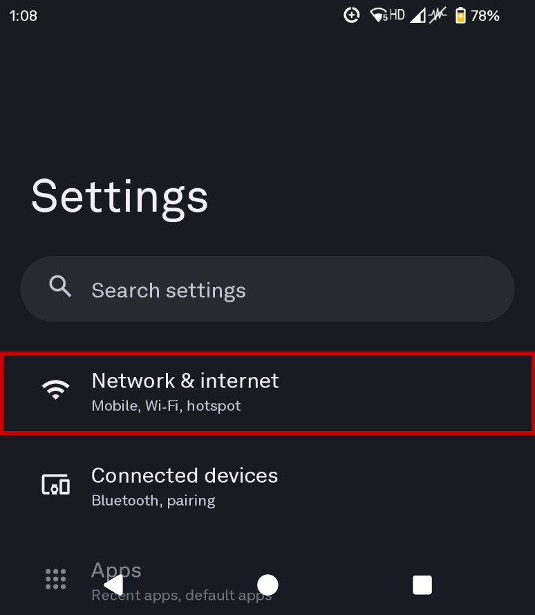

3. Find and select 'SIMs'.

    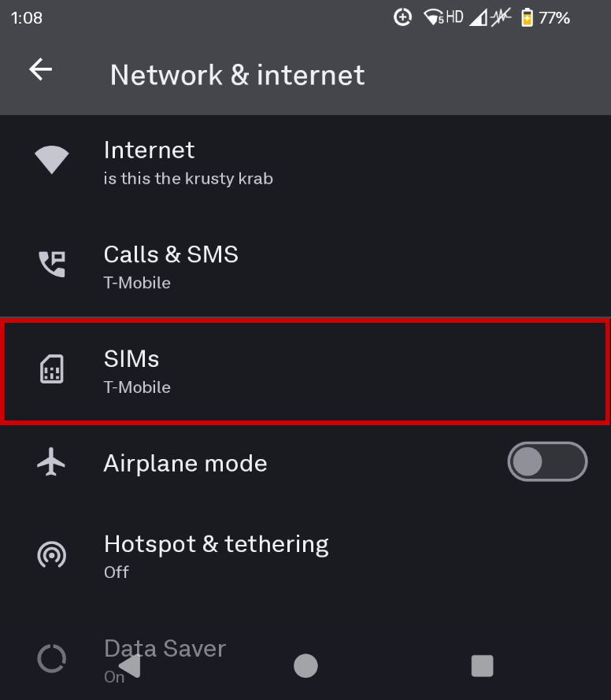

4. Choose the SIM(s) that are available for your carrier.

    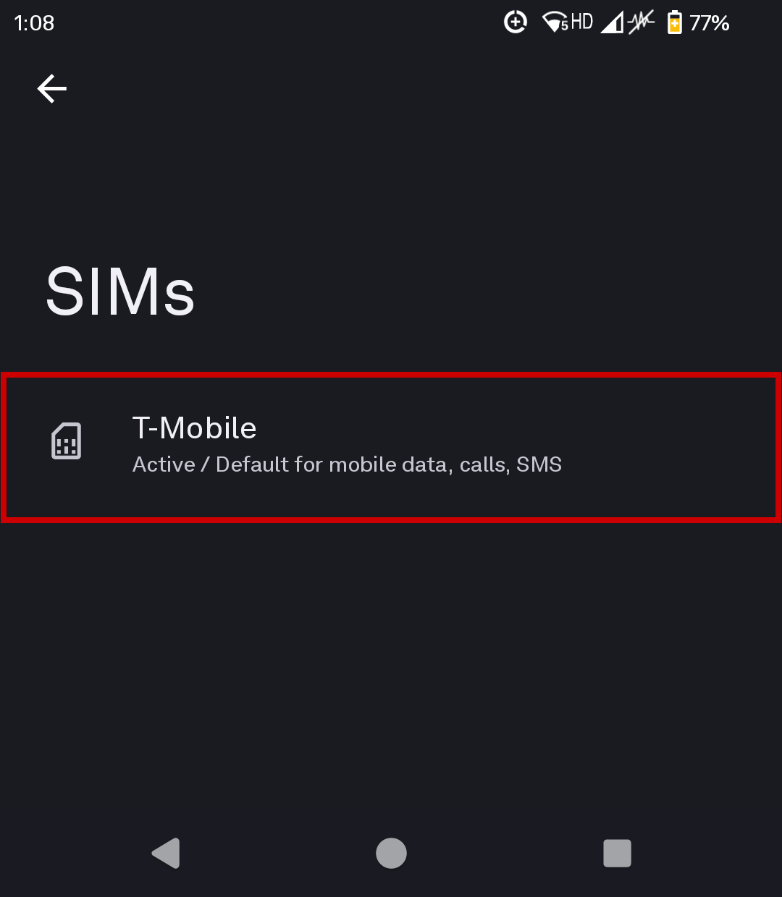

5. Find and select 'Preferred Network Type'.
    a. This is what will allow you to deprioritise 5G in favour of 4G.

    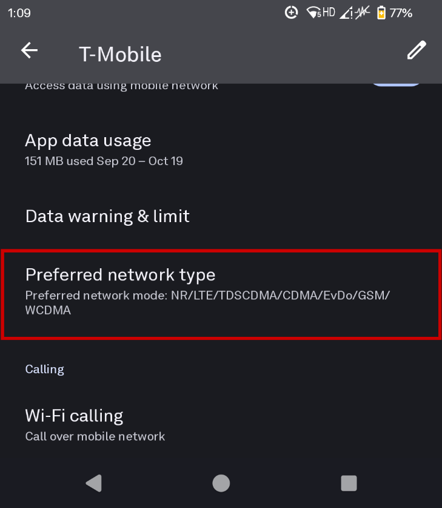

6. In the drop-down menu, find and select '**LTE/CDMA/EvDo/GSM/WCDMA**'.
    a. Default Light Phone network setting is '**NR/LTE/TDSCDMA/CDMA/EvDo/GSM/WCDMA**'. We don't want 5G in this case, so the option I told you to select is about as close as we'll get without 5G but allow us to use whichever carrier we want.

    b. LTE is 4G, CDMA and WCDMA allow for use on remaining Verizon networks or similar networks running CDMA (2G/3G), GSM is what the majority of the world uses for cell networks and is 2G, EvDo is 3G.

    i. Since the Light Phone III is unlocked, you can use any carrier you wish since the phone supports a wide range of frequencies and networks.

    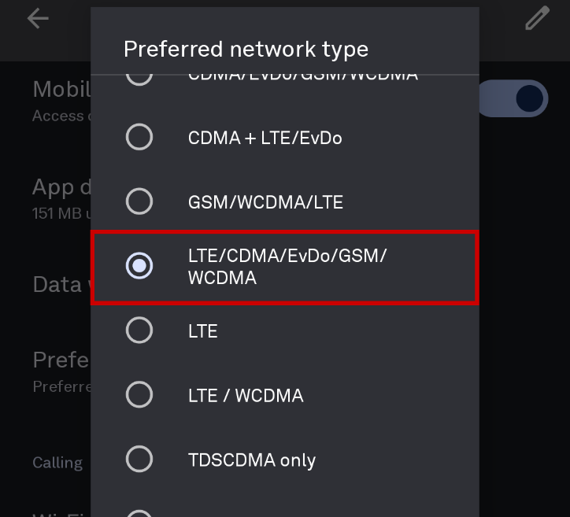



### Optional

If you wanted to select a specific network, for example in the case of roaming, you would do it here.



7. Under your carrier's SIM settings, find 'Automatically Select Network' and disable it.

    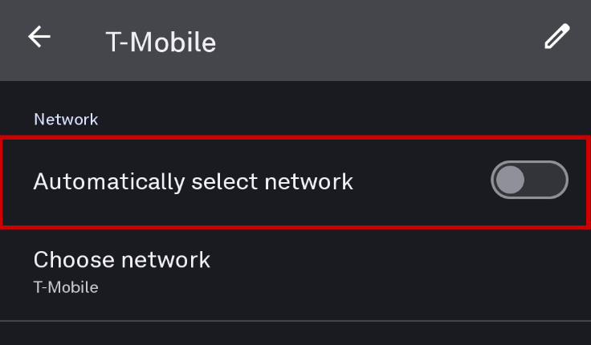

8. Select 'Choose network'.

    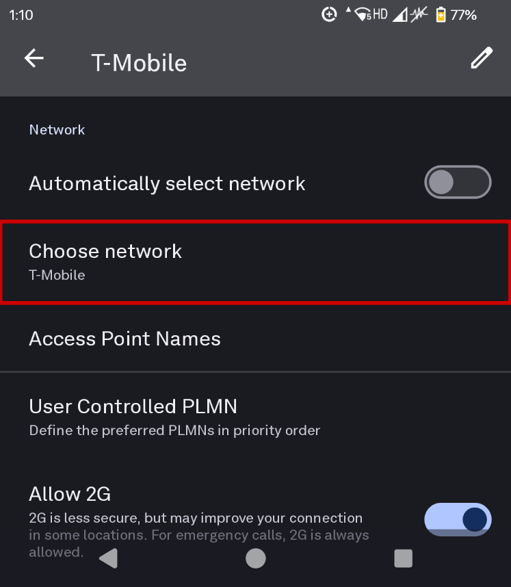

9. Select the network you wish to use.

    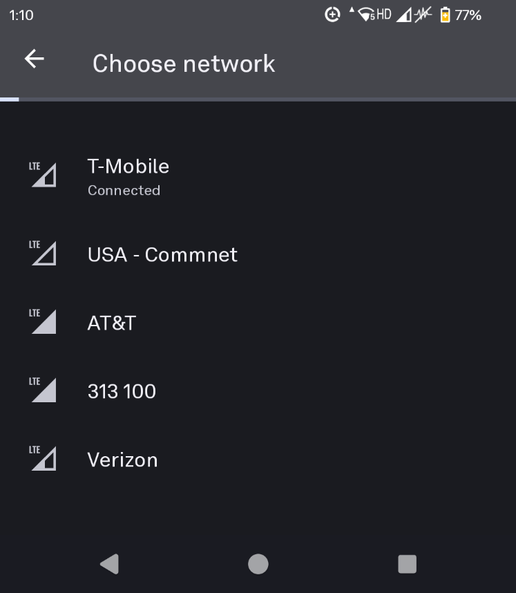

10. At the bottom of your carrier's SIM settings screen, you'll also find 'Allow 2G'. Verify this is on. Emergency calling relies on a 2G network and in certain locations, that may be all you're able to connect to i.e. 2G or EDGE.

    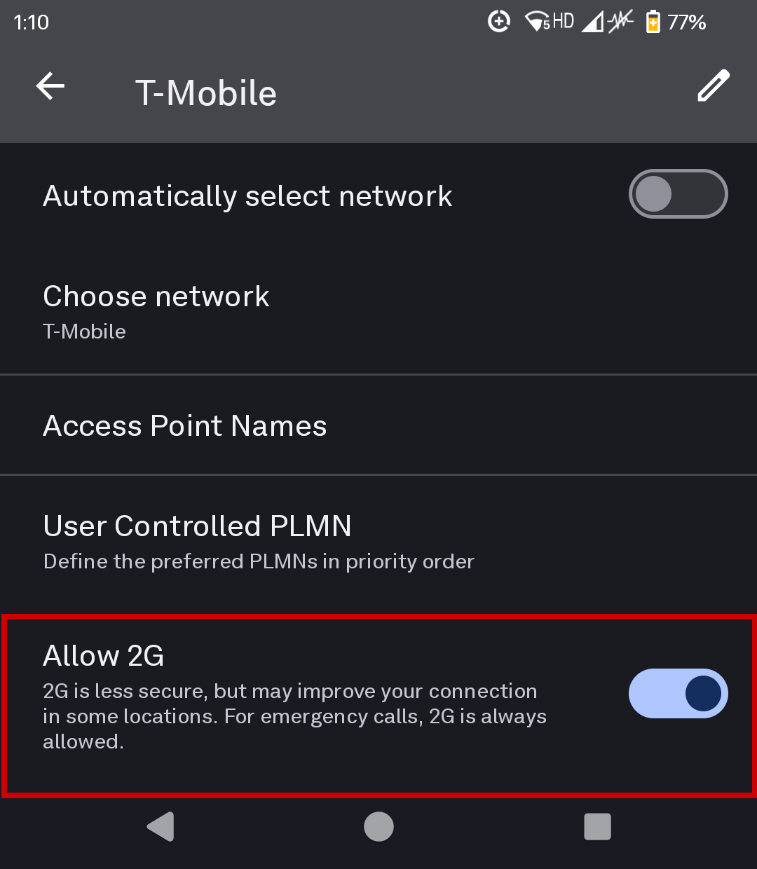



# Battery optimisation

This section is highly customisable and can be used for both Hybrid Mode and Full Android users. This is simply how I optimised my Light Phone III in terms of battery life, but it is all dependent on each individual's use case. Feel free to change these to your liking.

> [!NOTE]
> If you are running Hybrid Mode, do take into account that your battery life will not be anywhere as good as full Light or Full Android. You can optimise it to the best of your ability, but it simply won't compare.

## Basic battery optimisation

In order for you to get the most battery life out of your phone, there are a few basic concepts that you should be aware of:

### AMOLED display

The Light Phone III uses an AMOLED display. Displays, regardless of which one a device is equipped with, will consume battery just by being on. Now, certain displays consume energy far less than others. Black and white/grey e-ink displays, for example, use less energy by simply being on but if they're refreshing (for ghosting or general use), they will use a bit more but not nearly to the extent of colour displays.

When it comes to different types of displays, LCD, LED and OLED are some of the most common and use three different types of light to produce what we see on the screen.

Liquid crystal displays (LCD) use liquid crystals that open and close to control how much light passes through them. These are not typically used much in technology in favour of more energy efficient alternatives and higher contrast screens such as OLED and OLED variations but do have a place in affordability. Light emitting diodes (LED) is used with LCD in the implementation of an LED back-lit panel.

Organic light emitting displays (OLED) fall into a different category using LED that are self-emissive. This means there is no backlight, and the diodes produce their own light. OLED contains three colour diodes can be programmed to display a full colour spectrum using red, green and blue diodes (RGB). We can think of how colours are displayed below:

- All three RGB diodes on = white
- All three RGB diodes off = black
- All three RGB diodes on/off to varying degrees = multiple colours

Any pixels that are off or barely active means that they are consuming less energy than pixels that are mostly or fully on. _What that means in terms of battery consumption, dark mode (black, dark grey, etc.) consumes less energy than light mode (white)._

Active-matrix organic light emitting diode displays (AMOLED) are very similar to OLED. Both use thin film transistors (TFT) that function as a series of switches to control the amount of current flowing to each pixel. Without getting into the technical of it, both AMOLED and OLED have programmable pixels with diodes that emit their own light. In terms of AMOLED, each pixel also gets its own capacitor as well to actively maintain the pixel state while other pixels are being addressed.

AMOLED displays are highly regarded for their lower latency, higher refresh rates and significantly less power consumption. For the Light Phone III, that means that the screen will draw significantly less power that OLED or LED/LCD screens so you could operate the phone in a light mode as opposed to dark mode. However, generally speaking, the less diodes that are active, the less power that is consumed.

One of the downsides to AMOLED/OLED displays comes from the possibility of black smear or 'ghosting'. This is normal with these types of displays and is typically more noticeable in displays that produce true black. Since the Light Phone III is still in its infancy, we have yet to see how the phone deals with this characteristic.

### Charging

The way a phone is charged tends to get varying answers. At the end of the day, it is a lithium-ion battery and the technology for these types of batteries haven't changed much. Now, the Light Phone III does come with a removable battery and there will be the option to buy replacements. However, we want to extend the life of the battery as long as possible, so we don't need to replace it sooner.

For charging, you typically don't want to perform full charge and discharge cycles on the phone, which can cause stress on the battery. _The more charge cycles your phone goes through will decrease the battery life over time._ Generally speaking, it's recommended to keep the phone's battery between 20% or 40% and 80%. You should allow the phone to complete full charge and discharge cycles every couple of weeks to a month to recalibrate the battery but do not make a habit out of it.

For fast charging, it's nice if you need it in a pinch but I would use it in moderation. It's really easy to generate heat, which degrades the battery further, but also makes it easy to overcharge the battery which causes strain on it. If you're going to charge your phone overnight, use a slow charger.

### Usage

This should go without saying: _the more you use your phone, the more battery life you will consume._

The more you use the phone, the hotter the phone will get. As stated above, heat can cause premature degradation of the lithium-ion battery so we want to avoid that as much as possible. This can also include anything that is running in the background, even if you are not using the phone. You can find more information on lower-level Android processes **[HERE](../technical-context/#android-layers)**.

The Light Phone was designed to be used as little as possible. Regardless of whether you want full functionality of the phone or digital minimalist approach, you only have 1800mAH to use. That is a fraction compared to most modern smartphones that have nearly 3x that. Use it wisely.

## How I optimised my Light Phone

For the Light Phone III, I opted for a balance between strict battery consumption and usability. Overly restricting some applications, especially ones that deliver notifications, may cause delays or strange performance issues.

> [!NOTE]
> I also use colour correction with a dedicated key map to toggle it but I do want to note that it does nothing for the battery life. I use it as a personal preference, but the effect it has on battery use is negligible.

### Application settings

```
Settings > Apps > App battery usage
```

**Disabled**

Anything in this category I have an alternative in use or simply did not want until root.

- Android Keyboard (AOSP)
- Calendar (AOSP)
- Camera (AOSP)
- Chromium
- Clock (AOSP)
- Contacts (AOSP)
- DAVx⁵
- Gallery (AOSP)
- Search (AOSP)
- WebViewShell
- LightOS and associated packages
- Messaging (AOSP)
- Music (AOSP)
- Sherpa TTS Engine

Here is a complete list of my disabled packages at the moment:

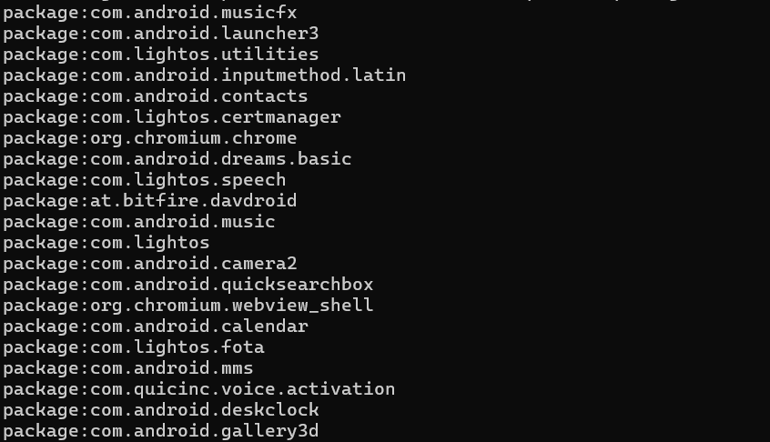

**Restricted**

Applications in this category I do not need running in the background nor do they give me notifications.

- Aurora Store
- Brave Browser
- Calculator (Fossify)
- Calculator++
- F-Droid
- Files (AOSP)
- File Manager (Fossify)
- Gallery (Fossify)
- Gboard
- Notesnook
- QuickStep (AOSP) — disabled on island
- Snapdragon Camera
- Sudoku / Solitaire (FOSS)
- Sound Recorder (AOSP)

**Optimised**

Applications in this category are frequently used and some need access to run in the background for notifications and/or functionality, but I do not need them all of the time.

- Breezy Weather
- Calendar (Fossify)
- Clock (Fossify)
- Contacts (Fossify)
- Greenify
- Island
- KeePassDroid / KeePassDX
- Music Player (Fossify)
- Open Camera
- Phone (AOSP)
- Proton Mail
- Settings
- Signal
- SIM Toolkit
- SimpleLogin
- Spotify
- T-Life
- Waze

**Unrestricted**

Applications in this category are needed 24/7 for functionality and/or notifications.

- Key Mapper
- QUIK SMS
- Messaging (AOSP)
- Phone (AOSP)
- Wireless emergency alerts

There are still many other Android system applications that may or may not benefit from restricting, although I haven't had much time or need to go through each one individually.

If you are running Hybrid Mode _not_ Full Android, do not mess with anything that LightOS was built off of for functionality. This includes but is not limited to: Phone, SMS, Call Logs, DAVx⁵ and anything with 'Light' or 'LightOS' in the name. These allow the Light side to operate and function properly.

### Usage

Generally speaking, I see the best battery life with then phone is used minimally – as it was intended. However, I have been using it more frequently, and even then I see anywhere from 1.5 – 3 days of battery life.

I have generally taken the approach of an utility-based digital minimalist phone that has all of the functionality that I need but none of the fluff and bloat. Strictly bare bones for what I need. I have essentially made my phone FOSS-based and de-Googled to the best of my ability. That means I use absolutely zero Google applications and opt for FOSS alternatives where I can. Anything else, i.e. Spotify, is run in a sandbox via Insular (a fork of Island). I also employ the use of Greenify to hibernate any apps I'm not actively using.

Additionally, I use battery saver which forces dark mode, disables the lock screen screen saver and always on display (AOD), as well as data saver, 24/7. Coupled with 4G/LTE priority instead of 5G/NR.

Here is an example of the battery life I see on a typical charge cycle:

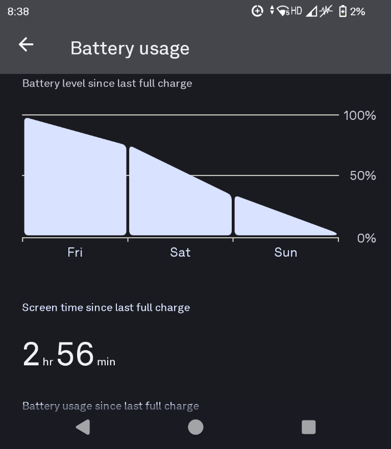

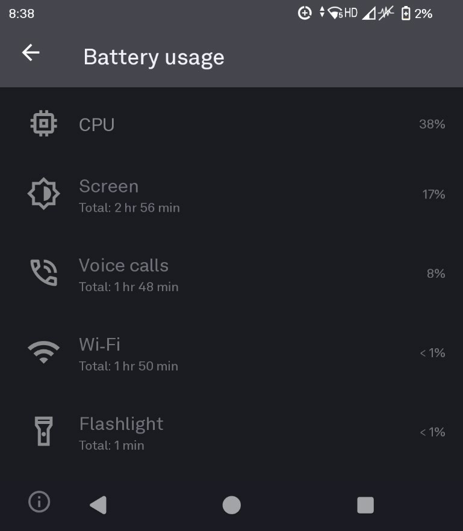

### Greenify

Regardless of if you're running Hybrid Mode or Full Android, Greenify will likely be your best friend.

Greenify is an automated hibernation app. While not the most privacy-friendly app on the Play / Aurora Store, it is absolutely key in making sure your battery isn't draining too quickly. The hibernation that the app uses is 'force stopping' applications. You could go through your settings and choose each individual app to force stop, but I find Greenify to make the process simpler in automatically doing it and it works for the Light Phone as it has a 'non-root' version as well.

The 'Automatic Hibernation' feature will work for most people. You select which apps you want to hibernate, and when the screen goes off, it will automatically force stop any apps that are currently running in the foreground or background. I recommend this for all Hybrid Mode users so that you can manage the battery life a bit better, without having to jump through extra hoops. It can also be a set-it-and-forget-it, so you don't need to go back into the app if you don't need to. Do keep in mind that you may miss notifications if you are hibernating apps that require background usage i.e. Signal or WhatsApp, etc.

For Full Android, I would suggest using the Quick Action Notification bar, especially if you have access to the status bar. This way you can have a silent notification that lets you know which apps need to be hibernated and can be hibernated from the notification shade.

> [!NOTE]
> If using apps in the Work Profile that you have selected for hibernation, you may need to 'Open Settings' when hibernating apps for Greenify to work properly. Apps in the Work Profiles do not play nice with the Automatic Hibernation feature.

# Syncing

Another function you may want is the ability to sync your phone's data to your computer or a server. Out of the box, the Light Phone III uses DAVx⁵ to sync phone data to Light's servers. There is no option to opt out of this, unless you go through the Android layer to disable / change it. This allows your contacts, music, gallery, messages, podcasts, etc. to sync with Light's server.

You can disable DAVx⁵ via System Settings without adb if you wish, or you can set it up to sync with your own server / online cloud.

## To disable

```
Settings > Apps > All Apps > DAVx⁵ > [Disable]
```



1. Navigate to Settings.
2. Find and select 'Apps'.

    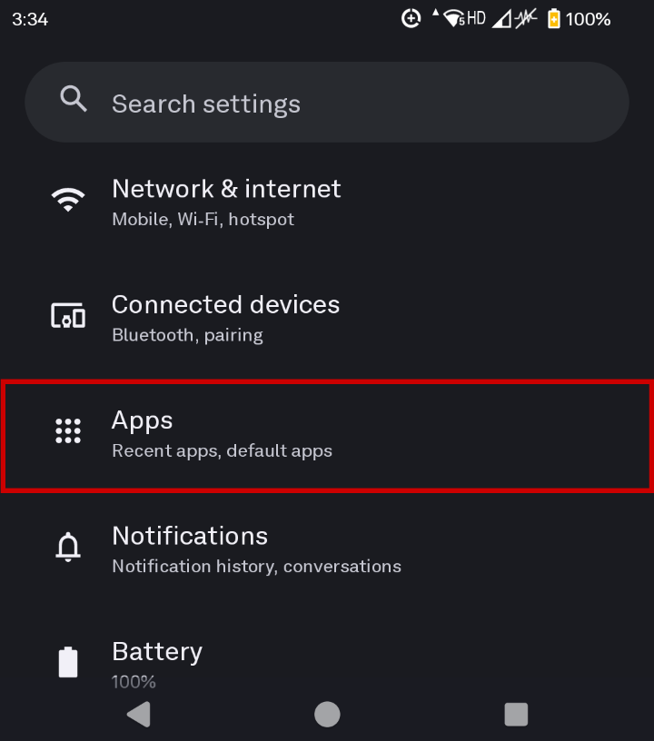

3. Find and select 'All apps'.

    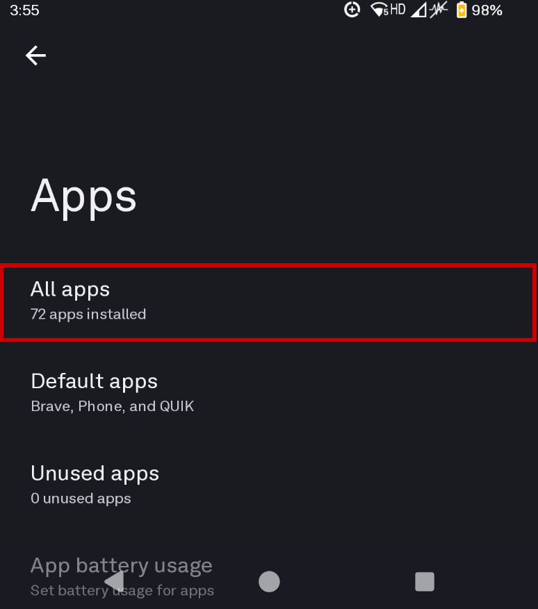

4. Find and select 'DAVx⁵'.

    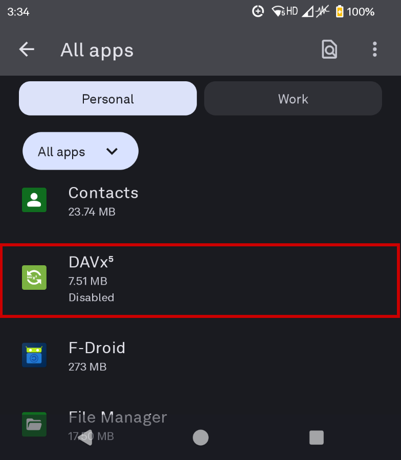

5. Disable.

    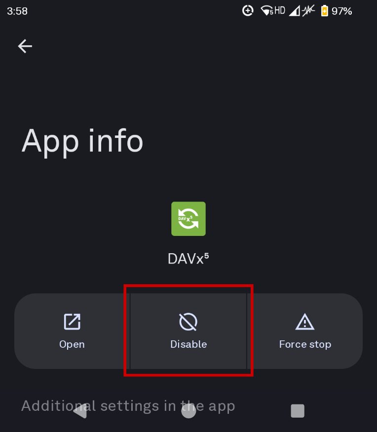



## To reconfigure



1. Navigate to DAVx⁵.
2. Clear 'Scheduled synchronization' prompt.

    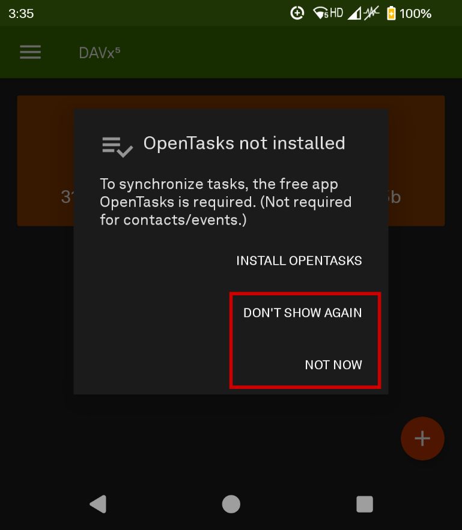

3. Clear 'OpenTasks' prompt.
4. On the home screen, you'll see an account already listed.

    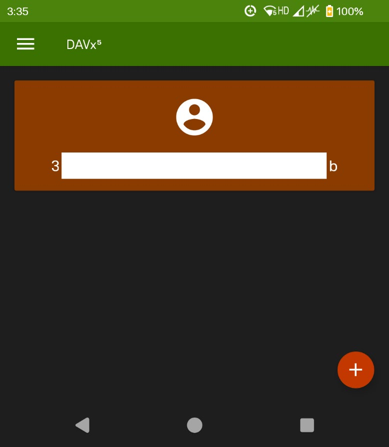

5. Click on the account. Here you'll find what syncs with Light's servers via CardDAV and CalDAV.
6. Click the 3 vertical buttons on top.

    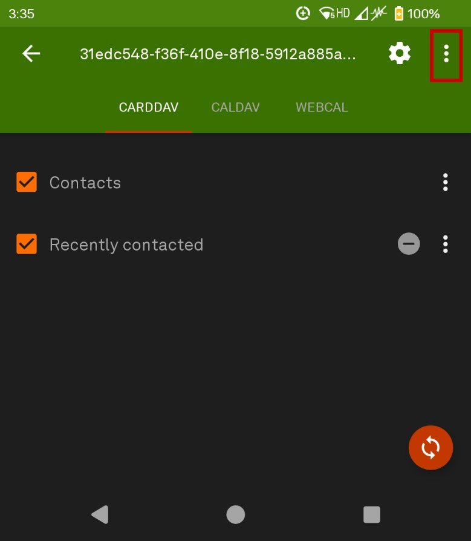

7. Select 'Delete account'.

    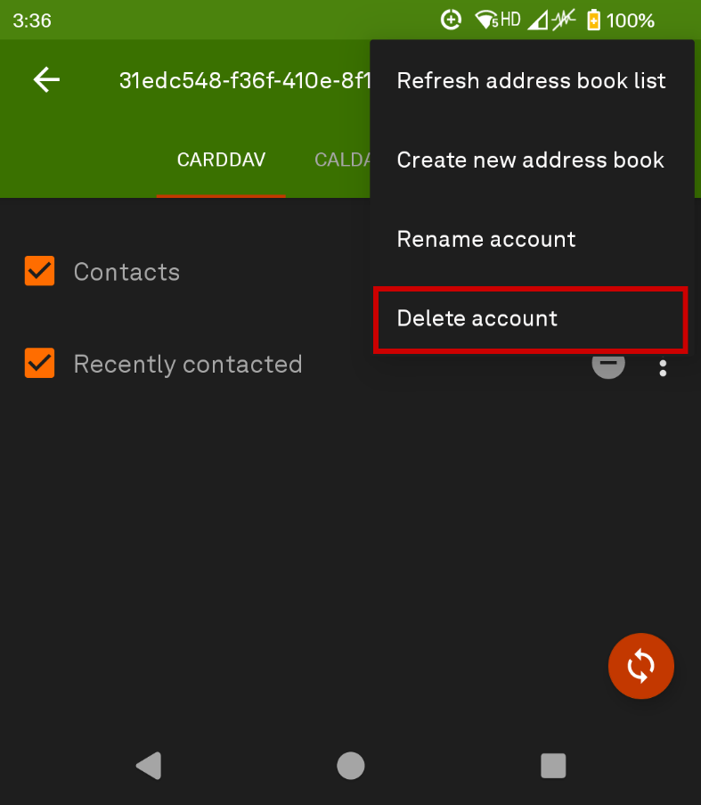

8. On the 'Really delete account' prompt, select 'OK'.

    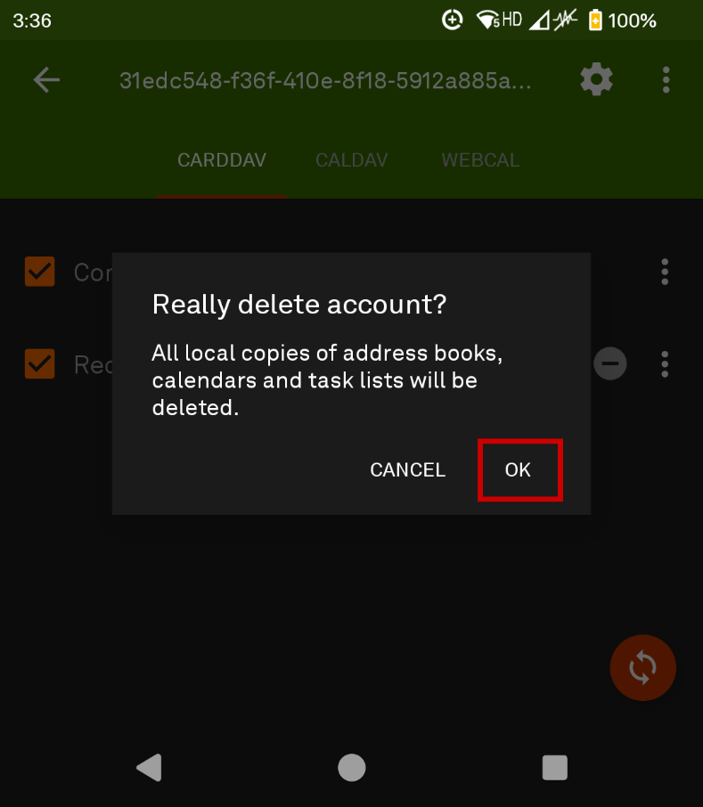

9. Now on the home screen, you can press the '+' at the bottom of right-hand corner to add a new account.

    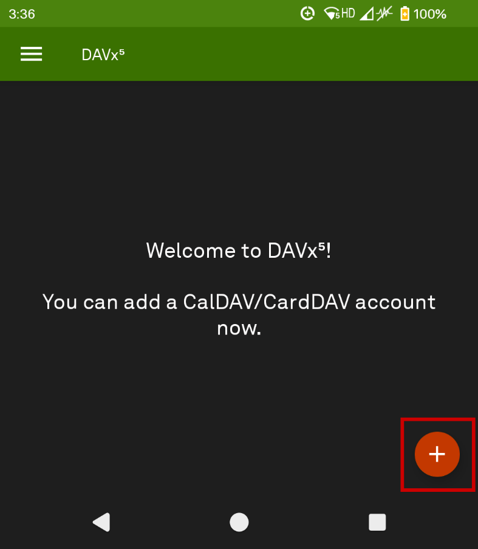

    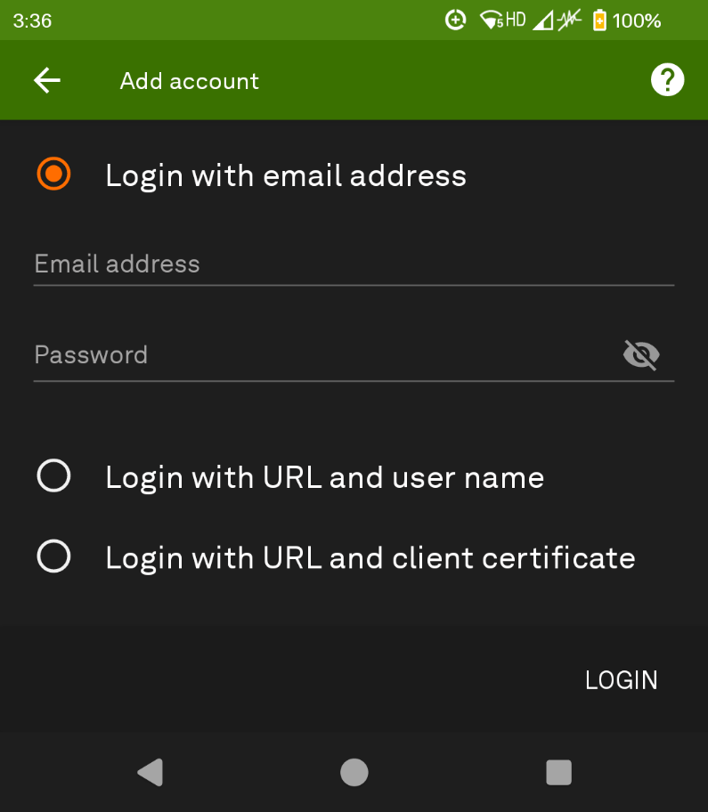



You can find the [list of tested services](https://www.davx5.com/tested-with/) should you wish to set up syncing for Google or iCloud for example.

Click **[HERE](https://manual.davx5.com/index.html)** for a link to the DAVx⁵ documentation.

# Light Phone II Root

Now, I'm fully aware that this is a Light Phone III specific modding guide, but I wanted it to be included in this guide since some folks have a Light Phone II and may wish to mod theirs as well. Since a lot of the Android specific changes we make on the Light Phone III are [applicable to the Light Phone II as well](https://www.reddit.com/r/LightPhone/comments/jqtfu4/comment/gcwqx8i/), it makes sense to include it. This is taken from a [collection of posts](https://www.crpntr.xyz/2025/09/installing-android-11-on-light-phone-2.html) from u/zeneval and u/No-Initiative-9079 via Reddit. For this, I'll be referencing the [most recent guide](https://www.reddit.com/r/ModifiedLightPhones/comments/1njvqdk/lp2_a11_guide/).

Before starting, I want to stress the importance of following these directions to enable Full Android mode in order and understand the instructions fully. Re-iterating my warning from the preface:

> [!CAUTION]
> In terms of liability, I am not liable if you mess up and/or brick the device. I have tried to make this as idiot-proof as possible to minimise the risks involved, but if you do something wrong, I am not at fault for it. There is a risk to modding a phone, especially in terms of jailbreaking or even delving into the lower levels of the API.
>
> **IF you do not understand the more advanced parts of this guide, do NOT attempt them. If you do not have an understanding of what you are doing, you are far more likely to break something.**
>
> Additionally, per [this comment from Joe Hollier via Reddit](https://www.reddit.com/r/LightPhone/comments/1jxtw0j/comment/mpvx94e/), Light deems use of the Android layer that results in a bricking or breaking the device as voiding the warranty of the phone. Know the risks involved and proceed with caution.

Once you understand the risks involved, we can get started.

What you will need:

- Light Phone II
- Computer with adb
- Reliable USB connection
- Files from the [LP2 Modding Repository via GitHub](https://github.com/dtingley11/LP2-Android-Script/tree/main).

## Android 11 installation

The Light Phone II uses Android 8.1 out of the box. It is known for its vulnerabilities (which allows us root access) but it isn't recommended for use for anything that needs to be secured. Since the Light Phone II is running an arm32 architecture, Android 11 is the last supported release.

The first thing you should absolutely do when rooting or flashing a phone is to dump the original flash as a backup so it can be restored if needed. Follow this guide carefully and in order.

### Dumping flash



1. Power off the device.
2. Hold VOLUME UP + POWER until the phone vibrates and then let go.
3. Once you see 'no command':
    a. Press and hold POWER, then press and hold VOLUME UP, then let go of VOLUME UP and then finally let go of POWER.
        i. This will drop you into the recovery menu for Android.
4. Select 'Reboot to bootloader' to get into fastboot.
    a. Use the VOLUME keys to move in the menu and POWER to select.
5. Once you're in fastboot and EDL mode, you can use Qualcomm Firehose / EDL tooling to pull down the flash.
    a. All Qualcomm devices support this type of tooling to program, dump and flash the chipsets.
6. Dump the flash as your backup before continuing.



### Step 1: Flash aboot and enable debugging

**Reboot the phone to fastboot mode**

1. Hold POWER + VOLUME DOWN until the phone vibrates and let go.
    a. The screen will remain on the 'Go Light' logo.
    b. Verify fastboot:

    ```
    fastboot devices
    ```

**Or**



1. Power off the device.
2. Hold VOLUME UP + POWER until the phone vibrates and then let go.
3. Once you see 'no command':
    a. Press and hold POWER, then press and hold VOLUME UP, then let go of VOLUME UP and then finally let go of POWER.
        i. This will drop you into the recovery menu for Android.
4. Select 'Reboot to bootloader' to get into fastboot.
    a. Use the VOLUME keys to move in the menu and POWER to select.



**Flash aboot**



1. Download aboot from the [LP2 Modding Repository via GitHub](https://github.com/dtingley11/LP2-Android-Script/tree/main).
2. Flash it:

    ```
    fastboot flash aboot aboot.img
    fastboot oem adb_enable 1
    ```



### Step 2: Access debugging & service menu



1. Open the Service Menu for additional settings:

    ```
    adb shell am start -n com.arima.servicemenu/com.arima.servicemenu.ServiceMainActivity
    ```

2. Set home activity to Launcher3 (QuickStep):

    ```
    adb shell cmd package set-home-activity "com.android.launcher3/com.android.launcher3.Launcher"
    ```

3. Stop the LightOS process:

    ```
    adb shell am force-stop com.lightos
    ```

4. Open Android Settings (since there are no control or navigation buttons).

    ```
    adb shell am start -a android.intent.action.MAIN -n com.android.settings/.Settings
    ```

5. Enable Developer Options.
    a. You can find the [complete guide](../developer-options/#android) since it works regardless of which version of Android you are using.
    b. In Developer Options, enable 'OEM unlocking'.



### Step 3: Unlock bootloader



1. Reboot to Fastboot Mode:

    ```
    adb reboot bootloader
    ```

2. Unlock the bootloader:

    ```
    fastboot oem unlock-go
    fastboot getvar unlocked
    ```

3. Reboot the device:

    ```
    fastboot reboot
    ```



### Step 4: Download required files



1. Download the Android 11 system image:
    a. [Treble Experimentations AOSP 11 Image via GitHub](https://github.com/phhusson/treble_experimentations/releases?q=313&expanded=true)
        i. Recommended: `system-roar-arm-aonly-vanilla` OR `system-roar-arm-aonly-gogapps`
2. Extract the file to obtain the .img file.
    a. Windows: [7-Zip](https://www.7-zip.org/)
    b. MacOS: [The Unarchiver](https://macpaw.com/the-unarchiver)
    c. Linux: Use `unxz`



### Step 5: Flash Android 11 to the LP2



1. Reboot to Fastboot Mode:

    ```
    adb reboot bootloader
    ```

2. Flash the system image:

    ```
    fastboot flash system <system>.img
    ```

3. Wipe the device:

    ```
    fastboot -w
    ```

4. Reboot:

    ```
    fastboot reboot
    ```



### Step 6: Enable ADB and secure device



1. Copy adb_keys from another device.
    a. Securizing will remove adb keys, this will copy your current keys from your computer to the device.

    ```
    adb root
    adb remount
    adb push ~/.android/adbkey.pub /data/misc/adb/adb_keys
    ```

2. Run the **securize** script
    a. Device will reboot.

    ```
    adb shell /system/bin/phh-securize.sh
    ```



### Step 7: Continue set-up & customisation

- Disable camera:

    ```
    adb shell pm disable-user --user 0 com.android.camera2
    ```

- Disable Google search:

    ```
    adb shell pm disable-user --user 0 com.android.quicksearchbox
    ```

- Set to LTE mode:

    ```
    adb shell settings put global preferred_network_mode 11
    ```

- Restart radios:

    ```
    adb shell "svc data disable && svc data enable"
    ```

- Verify LTE mode (should return '11'):

    ```
    adb shell settings get global preferred_network_mode
    ```

### Step 8: Install Magisk for root access

No boot.img to list, will need to supply your own.



1. Download [Magisk via GitHub](https://github.com/topjohnwu/magisk/releases).
2. Install Magisk:

    ```
    adb install <magisk>.apk
    ```

3. Open Magisk on the device.
4. Push the boot image:

    ```
    adb push <bootimg.img> /mnt/sdcard/Download
    ```

5. Select Install from Magisk.
6. Select the boot image when prompted to patch the image file.
7. Pull the patched image back to your computer:

    ```
    adb pull /mnt/sdcard/Download/magisk_patched-xxxxx.img patched.img
    ```

8. Reboot to fastboot mode again and flash the patched image file:

    ```
    fastboot flash boot patched.img
    fastboot reboot
    ```



### Step 9: Fix Verizon APN issues (optional)



1. Download VZFix.
    a. As of September 2025, there is no file available at the moment. u/No-Initiative-9079 will be adding all missing files including boot.img and VZFix to GitHub no ETA.
2. Replace the APN config file:

    ```
    adb push VZFix/system/etc/apns-conf.xml /mnt/sdcard/Download
    adb shell
    su
    mount -o remount,rw /system
    rm -rf /system/etc/apns-conf.xml
    mv /mnt/sdcard/Download/apns-conf.xml /system/etc/
    mount -o remount,ro /system
    ```



### Step 10: Enable VoLTE and fix refresh rate



1. Enable IMS and VoLTE:

    ```
    adb shell
    su
    setprop persist.dbg.allow_ims_off 1
    setprop persist.dbg.volte_avail_ovr 1
    setprop persist.dbg.vt_avail_ovr 1
    setprop persist.dbg.wfc_avail_ovr 1
    setprop persist.sys.phh.ims.caf true
    ```

2. To enable calling, navigate to `Settings > Network > Mobile Network > Advanced > Preferred Network > 4G`
3. Change refresh rate to prevent excessive refresh:

    ```
    adb shell settings put system peak_refresh_rate 2.0
    adb shell settings put system min_refresh_rate 2.0
    ```



## Other useful settings

I ripped this from the Discord server and I believe it has a place here as well. This is a long single command, but it allows system dialogs, status bar, navigation bar and enabling some Bluetooth settings:

```
am start -n com.android.launcher3/com.android.launcher3.Launcher &&
setprop persist.lightos.disable_status_bar_notifications "false" &&
setprop persist.lightos.disable_system_bluetooth "false" &&
setprop persist.lightos.disable_status_bar_notifications "false" &&
setprop persist.lightos.disable_dialog "false" &&
settings put system navigation_bar_enabled 1 &&
settings put system status_bar_enabled 1 &&
settings put global heads_up_notifications_enabled 1 &&
settings put global captive_portal_mode 1 && echo 0 >
/sys/devices/virtual/graphics/fb0/os_mode && echo 4 >
/sys/devices/virtual/graphics/fb0/wf_mode && echo 1 >
/sys/devices/virtual/graphics/fb0/Bflash && echo 1 >
/sys/devices/virtual/graphics/fb0/Bflash
```

## References

Some other references to modding the Light Phone II are below:

- [How to install stock Android 11 onto The Light Phone 2](https://www.youtube.com/watch?v=doJh23QmIQ0)
- [Light Phone 2 Android || Android on E-Ink](https://www.youtube.com/watch?v=aOXGuFKQ0_E)
- [Tutorial: Android for the Light Phone 2](https://www.youtube.com/watch?v=ngRuS9svSrE)
