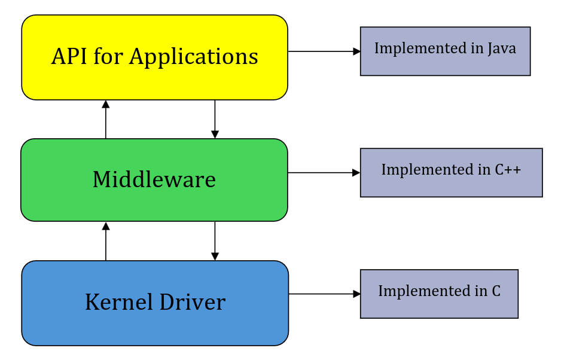

I understand that LightOS doesn’t fit the use cases of some of its users, and it will continue to be a work in progress for many years to come. Some users enjoy the LightOS aesthetic and ethos, whereas some feel it is lacking.

Regardless of your feelings on the matter, it’s important to make the distinction between an operating system (OS) and a launcher. LightOS is **not** an OS. The operating system on the phone is Android 14 and the launcher is a React Native App built on top of vanilla Android 14. Their operating system of sorts _is_ code-signed to AOSP platform keys which allows their launcher app to access lower-level APIs, drivers and firmware that normal apps are not allowed to access. This allows their launcher app to embed into the depths of the phone – this is how it works independently of any vanilla AOSP applications that are present on vanilla Android. You can read more in depth about how they developed the React Native app **[here](https://medium.com/sanctuary-computer-inc/building-lightos-with-react-native-4b6e4ad1cd7f)**.

Now, you may be asking about rooting the phone. As of the beginning of September 2025, there is no root available for the phone. While it is _possible_ to root the phone at this time, it is **not** recommended. There is no custom recovery for the phone. If you so choose to root the Light Phone III with a patched image file of Android 14, do understand that we do not have access to the drivers – you will lose functionality of some of the additional hardware that came with the phone.

# Android layers

For those who do not have a general understanding of layers, I'll do my best to explain it and have provided a diagram in **Figure 1.1.** for visual representation.

First, we have the API layer for applications. This is the user-facing software side and where users interact with the device. Applications or APKs are typically developed in Java / Kotlin but may include JavaScript (JS), CSS and Python to name a few. All applications, AOSP, LightOS, etc. have their user-interface on this level.

Secondly, we have the middleware layer, which allows our high-level (APKs, GUI, etc.) to communicate with our low-level. It is our program layer that contains the framework for applications to run. It’s everything that allows an application to operate in the way it does. It also contains the libraries for developers and programs to access lower-level OS and hardware primitives and privileges. This is typically implemented with C++ / C, although SQL, Scala, Python and PHP, etc. can be used in this level as well.

Finally, we have our low-level layer, the Kernel Driver layer. Android is built off of Linux, so the root component is the Linux Kernel. This is base hardware level that contains device drivers, memory and process management and is typically implemented in C but Java can also be used. There are two sub-layers to our lowest-level within Android – Hardware Abstraction Layer (HAL) and the Linux Kernel, but to keep it simple, we’ll just refer to this as the lowest-level within Android as a whole. Anything that is considered additional hardware needs a driver in order for the software side to interact with it, otherwise it’s useless. USB, Bluetooth, Wi-Fi, display, audio, power manager, flash memory, binders, camera, microphone, antenna, all of these additional devices will not work without the necessary drivers supplied by their respective manufacturers. No drivers = the operating system can’t use them. In the case of the Light Phone III, we also need to make mention of the flashlight button, scroll wheel, home button and camera button. Within the Linux kernel, we also have our memory management that manages memory space to ensure applications don’t conflict and overwrite each other. The Linux kernel also contains the process management, which manages different processes running on the phone which can include: creating, pausing, stopping, or killing processes. The kernel layer is responsible for communicating between different processes, allocating RAM as necessary for applications as well as ensuring it is freed up when processes are killed and maximising the performance of the device.

# What is 'accessing Android'?

In the context of accessing the Android layer, it’s crucial to understand what we are actually doing when we access it. LightOS sits on top of vanilla Android but does not replace it. When we access the Android layer, we are simply stepping outside of the bounds of what the LightOS app runs in. Originally, with version v4xx (typically v466) there was a key sequence that was available to access the Android layer. Since users were accidentally accessing Android, it was patched in later versions. There is only way to access it reliably, which is via a keyboard which is explained **[HERE](/resources/modding-guide/how-to-access-the-android-layer/)**.

When we access the Android layer in terms of using it in tandem with LightOS, we are staying within the high-levels of Android. We aren’t changing the functionality of the phone or LightOS and are simply giving us, the user, access to a different part of the phone on the same level. We aren’t changing anything deep within the phone at this point so there is far less risk to the device.

# Security concerns

There are many implications from having easy access to Android, whether or not you are aware of it, the biggest of which is the security of the device. LightOS has its own version of a lock screen, however, even with that enabled and a keyboard handy, you’re still able to access the Android layer and access files that are typically hidden behind LightOS’s application. It is imperative to lock the phone, LightOS and Android alike, to prevent any unauthorised use whether that be from prying eyes, unsavoury figures, or accidental use like, say, butt dials.

For the security of the device locally, I like to use an analogy of Android acting as your home. Assuming that there are no lock screens enabled (either on Android or LightOS), it is like saying there are no doorknobs or locks on the doors. LightOS is a single room in said house. Enabling a lock screen only on LightOS is like having a single doorknob to that room, but it isn’t truly locked. This means that everything in the LightOS 'room’ can still be seen and accessed by anyone that has access to the house. It’s under the false pretense that it is locked and secured but in reality it is not. Another thing to assume is that the low-level API and relevant source code is treated like the electrical panel. No one has a key to this except the owners of the house (the developers) and it is what powers the house.

Using this analogy, we, as the user, are able to freely roam through the house (our Android device) which also includes the LightOS 'room’ but we do not have access to the electrical panel and its subsequent root/su (superuser) privileges. When you enable the lock screen on LightOS, you are simply putting a doorknob on the door but it is not truly locked. Enabling a lock screen on the Android side is like installing true locks and doorknobs on the house to secure it. That doesn’t mean it’s impenetrable, just harder to get into.

Another thing to note is the implementation of DAVx^5. DAVx^5 is a syncing and management application that is free and open-source. It is used to sync relevant information from your device to Light’s servers via CalDAV, CardDAV and WebDAV infrastructures. This is how you are able to sync your texts, contacts, pictures, music, podcasts, etc., with your Light Account Dashboard. If you want to continue using this function, you’re more than welcome to. However, I find issue with how the users were not given the _option_ to opt out of the service outside of not connecting the device to a Light Account. While Light claims its stance on privacy away from big tech, I have a hard time swallowing that it is completely harmless. I have it disabled but you are free to continue using it if you so wish. The guide to disable/reconfigure DAVx^5 is **[HERE](/resources/modding-guide/additional-guides/#to-disable)**.

