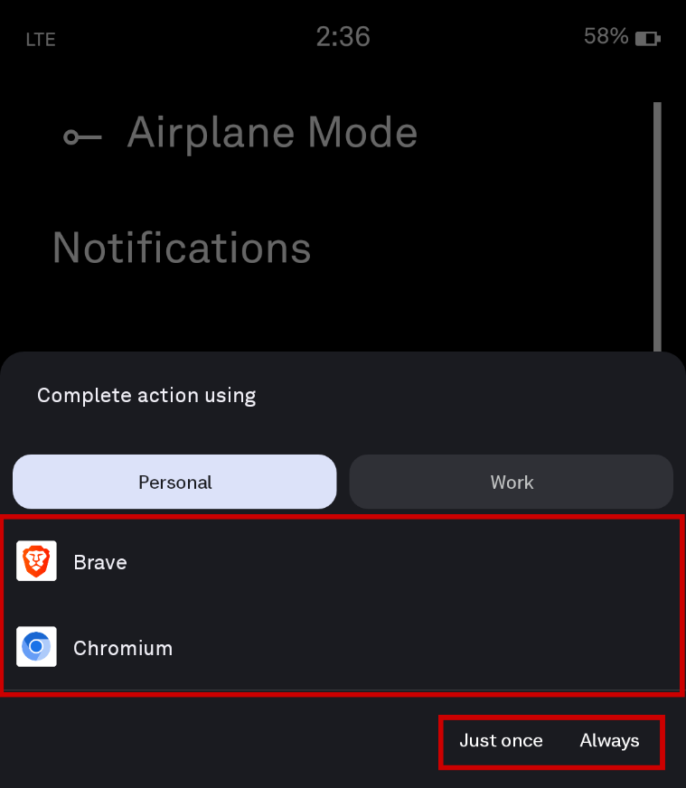
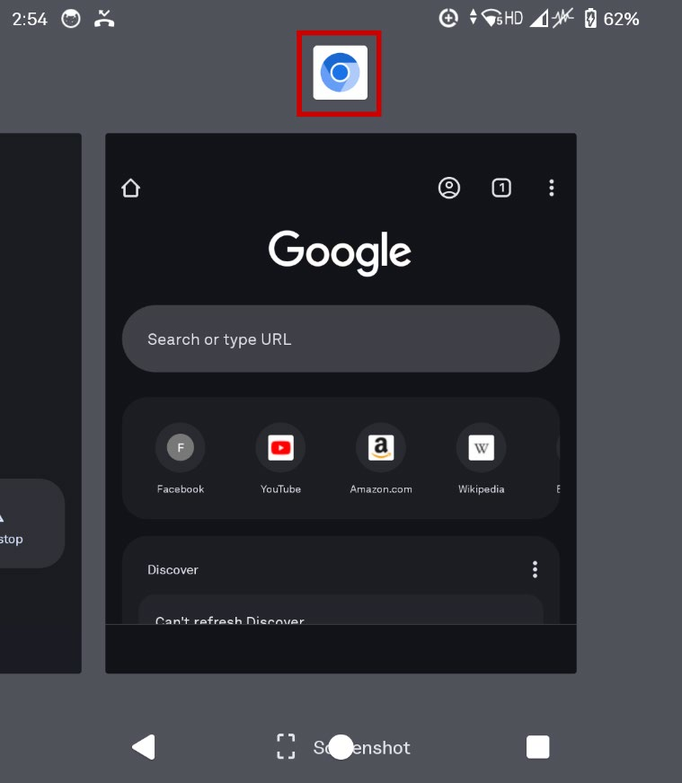
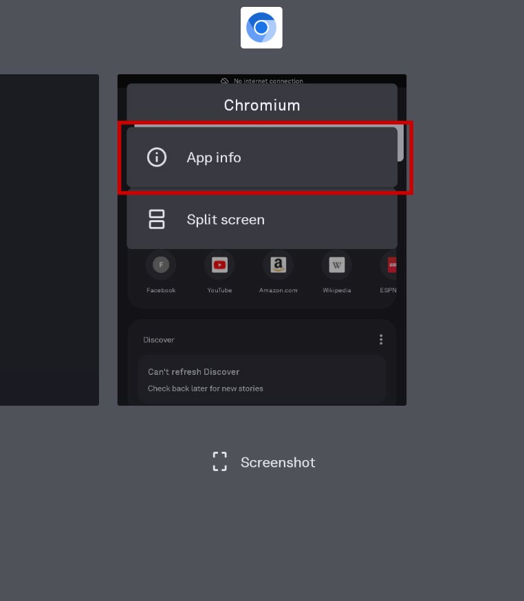
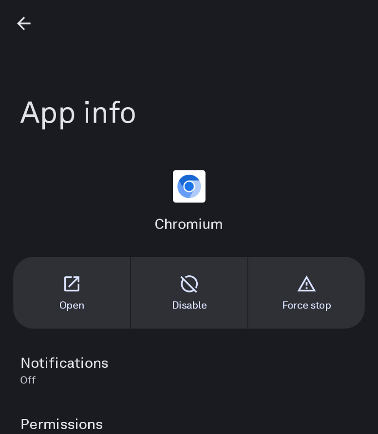
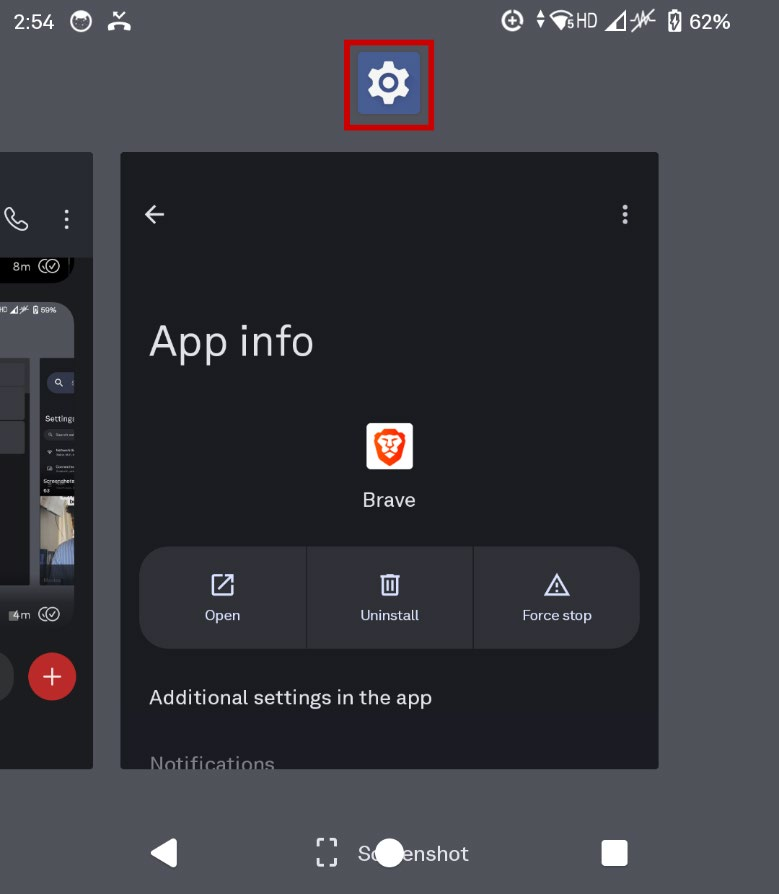
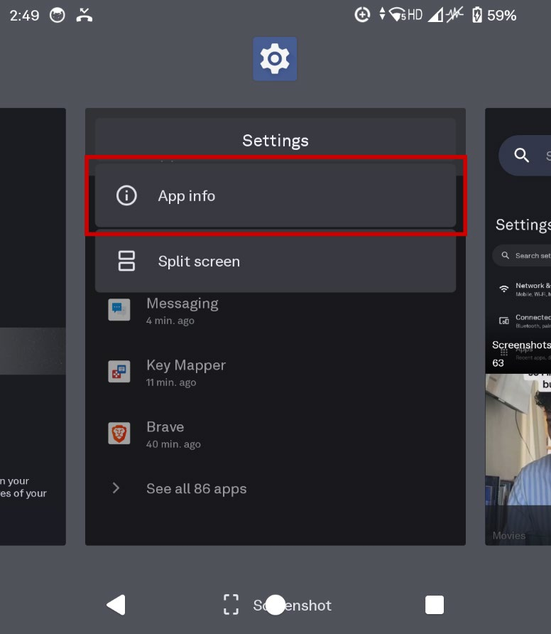
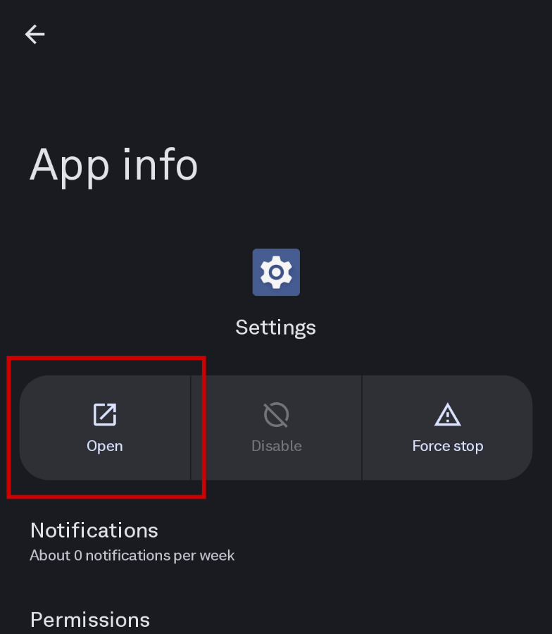
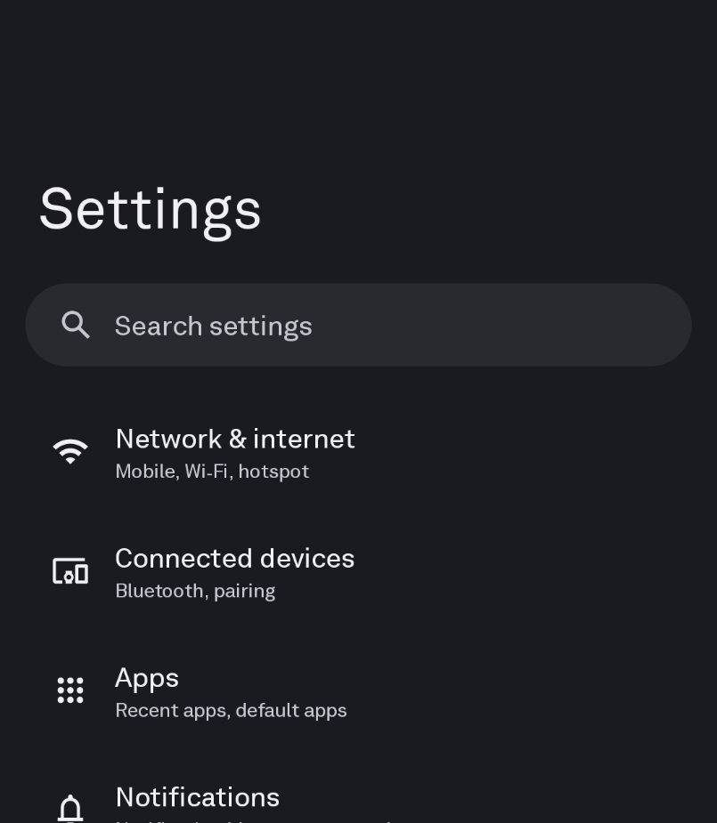

> [!NOTE]
> As of [Firmware v.1.440000](https://support.thelightphone.com/hc/en-us/articles/360031105751-Software-Versions-Change-Log), from 29 September 2025, Light has officially patched *some* Android access loophole for USB-C keyboards and by plugging the Light Phone into a smartphone (see [Software Versions & Change Log](https://support.thelightphone.com/hc/en-us/articles/360031105751-Software-Versions-Change-Log)). Even if you factory reset the phone, firmware updates will still persist. Factory resetting a device **only** removes user data in the user partition.

**Any keyboard combos or key sequences noted prior to October 2025, are no longer able to be used.**

Follow the instructions below for the updated access.

What you will need:

- Light Phone III
- Keyboard (either wired USB-C connection or wireless)
    - If the keyboard is wired but doesn’t have USB-C, USB-A to USB-C adapters will work fine as well.
    - Do not use any keyboards that have RGB or additional firmware – mobile phones do not supply enough power to power these keyboards and they will not work.

1. Unlock the Light Phone III.
2. Connect your keyboard to the device.
3. Use the key sequence `WIN + B` to open Chromium (AOSP web browser).
    - If you previously accessed the Android layer, you may be presented with multiple options. Pick one, it doesn’t matter.
    - If you have not previously accessed the Android layer, you will **NOT** get this screen as your default will already be Chromium.

    

4. Hold ALT + TAB, but do not release these keys.
    - This will open your recent apps.
5. Find Chromium and tap on the icon.

    

6. Select 'App Info'.
    - You can release the TAB key, but do not release ALT.
    - This will open the app in the system settings.

    

7. Once you see the following screen, depress ALT + TAB once more but do not release the keys.

    

8. Find Settings and tap on the icon.

    

9. Select 'App Info'.

    

10. Select 'Open'.

    

11. You’re now in the Android System Settings.

    
