This section is applicable to both Hybrid and Full Android users.

# Default applications

Within Android Settings, you will need to change the default applications of the Phone, Messaging and Home app. The AOSP options are fine for now while we set up the Android layer. This section is simply for the initial set-up of Android.

> [!NOTE]
> If at any point you accidentally select LightOS as the default Home app while setting up Android, it will reboot back into LightOS and you will have to access Android via a keyboard or keymap again.

```
Settings > Apps > 'Default Apps' > [Select Default applications]
```

1. In Settings, navigate to 'Apps'.

    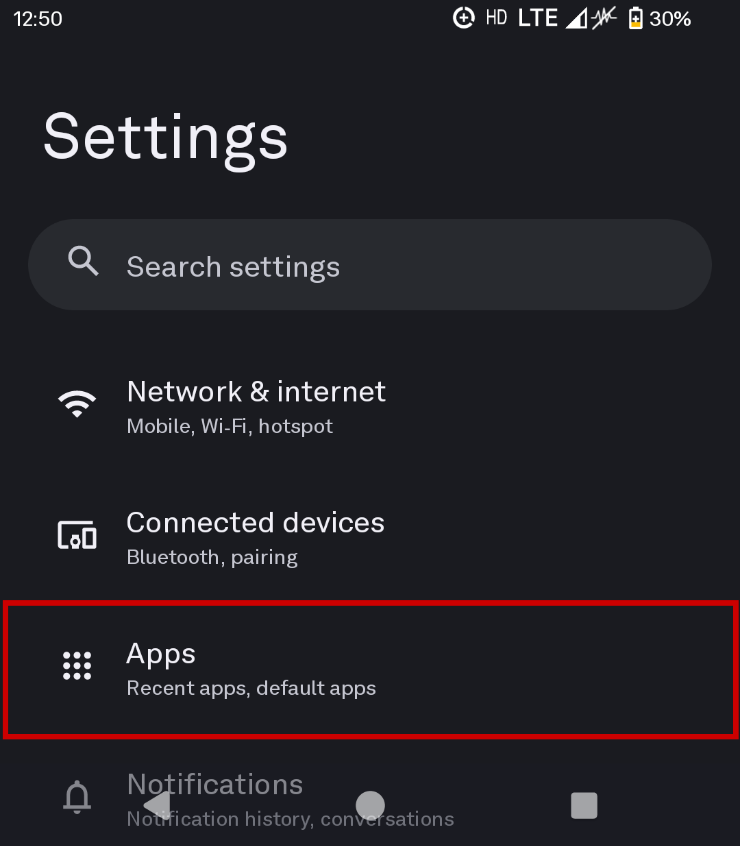

2. Select 'Default apps'.

    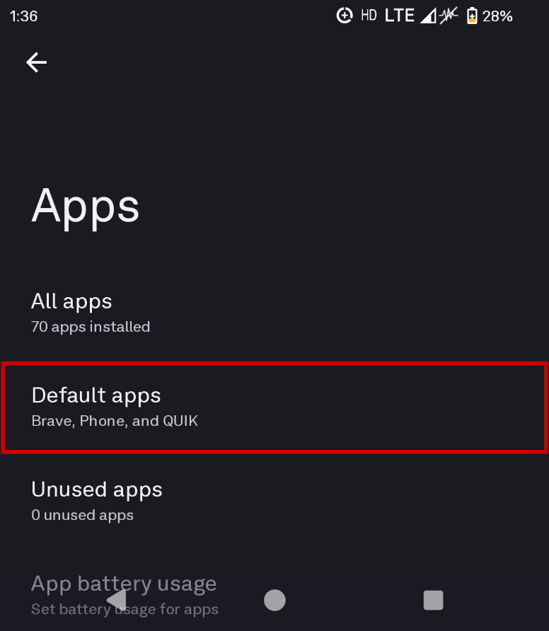

3. Here you will see the following screen:

    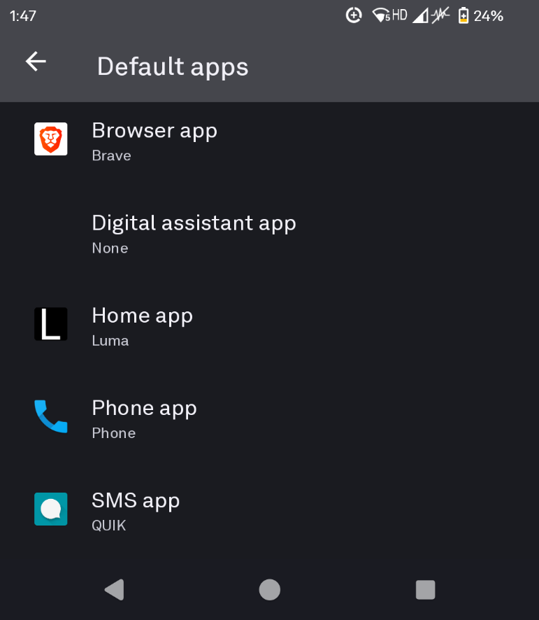

4. Here is the screen where you can select the default applications:

    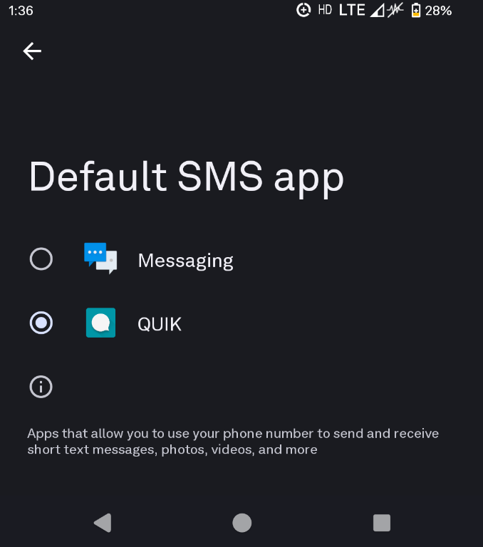

5. Change and/or verify your default applications are as follows:
    - **Browser app:** Chromium
    - **Home app:** QuickStep
    - **Phone app:** AOSP Phone
    - **SMS app:** Messaging

If you are using Hybrid Mode, once Android has been set up to your liking, you will need to change your default applications back to LightOS. You MUST do it in this order: Phone, then SMS, and finally Home. If you set the default Home to LightOS first, you will still have to go back to Android to set the defaults for the Phone and SMS in order to continue to receive calls and texts in LightOS.

# Keyboard

This allows you to type without needing the keyboard attached to the phone.

```
Settings > System > 'Keyboard' > 'On-screen keyboard' > Enable Android Keyboard (AOSP)
```

1. In Settings, navigate to 'System'.

    

2. Navigate to 'Keyboard'.

    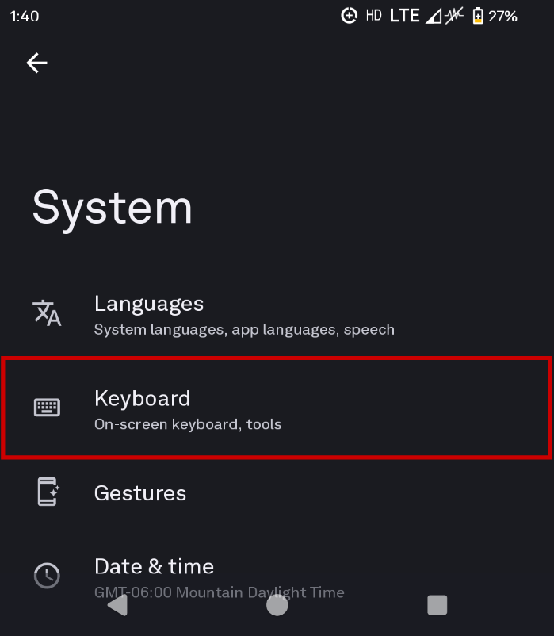

3. Select 'On-screen keyboard'.

    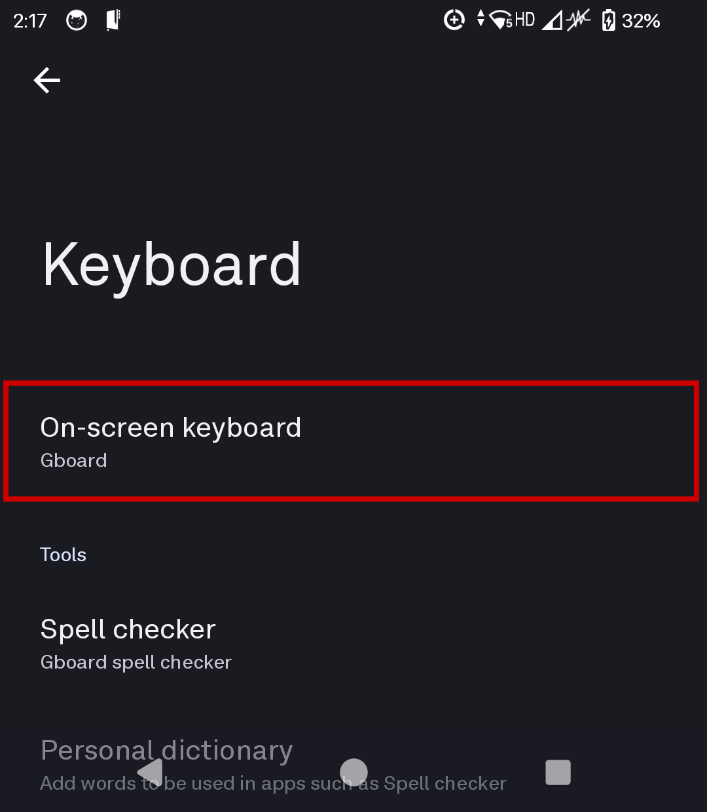

4. Find 'Android Keyboard (AOSP)' and enable it.

    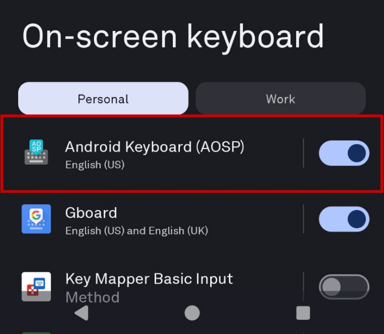

Whenever you have Android completely set up, feel free to change the keyboard to one of your choice. Some keyboards I would recommend for the Light Phone III are FlorisBoard (FOSS and customisable), FUTO Keyboard (FOSS and has swipe typing) or HeliBoard (FOSS). I do not have any recommendations for other languages at this moment. **Should you wish to use it, Gboard works as well, although not ideal for privacy purposes.**

# Gesture navigation

This is for basic navigation between apps, the home screen and recent applications. It will allow you to switch between apps on the Android side.

For Hybrid users, you do not have the option to select 3-button navigation. LightOS uses a global setting called `light_mode` which disables 3-button navigation, the status bar and other missing UI elements on Android. Every time LightOS is opened, `light_mode` is changed to `[1]` and is enabled again, even if you disable it with `[0]`.

Only Full Android users will be able to use the full functionality of 3-button navigation, the Android status bar and any formerly missing UI elements without needing to constantly change `light_mode`. You can find out how to disable `light_mode` **HERE**.

```
Settings > System > 'Gestures' > 'Navigation Mode' > 'Gesture Navigation'
```

1. In Settings, navigate to 'System'.

    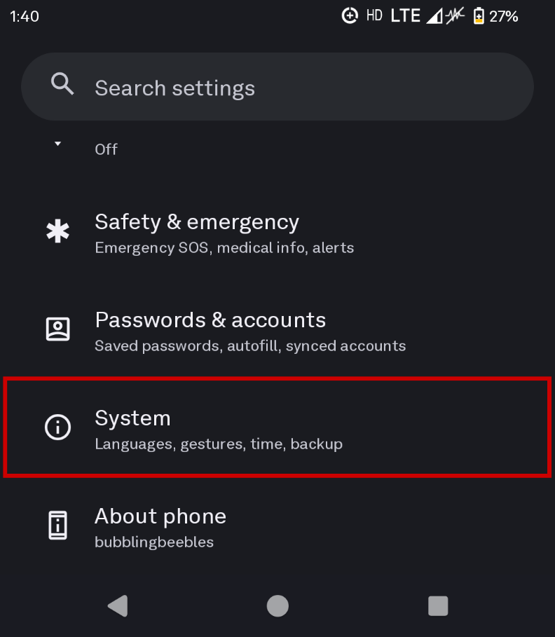

2. Navigate to 'Gestures'.

    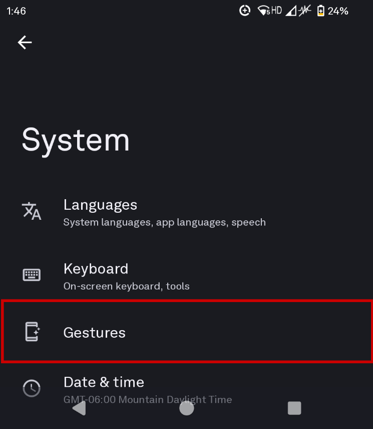

3. Select 'Navigation Mode'.

    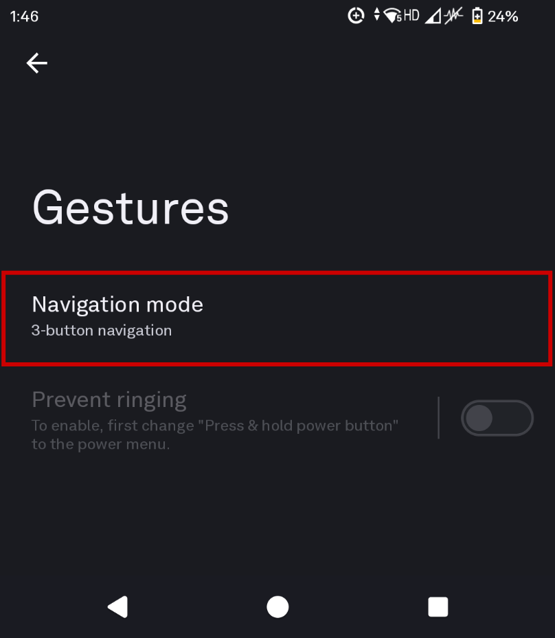

4. Select 'Gesture navigation'.

    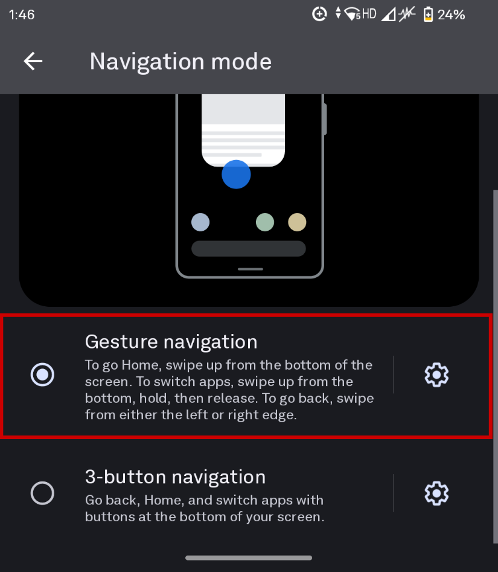

# Display and font size

Changing the display and font size is imperative in order to be able to see things on the screen that may not correct with the aspect ratio of the display. A common issue I've noticed with the original modding guide is that people seem to struggle with setting up the key maps by not being able to see the trigger option. You will only be able to see the trigger option IF you change the display and font size accordingly.

```
Settings > System > 'Display' > 'Display size and text' > 'Font / Display size'
```

1. In Settings, navigate to 'Display'.

    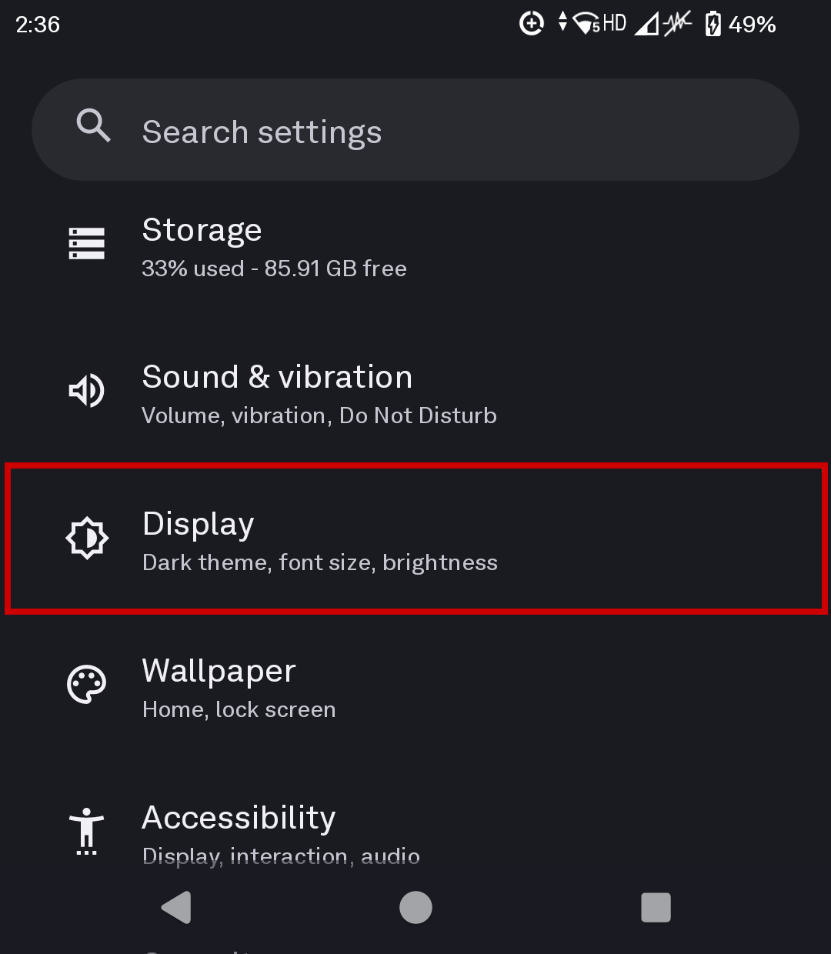

2. Navigate to 'Display size and text'.

    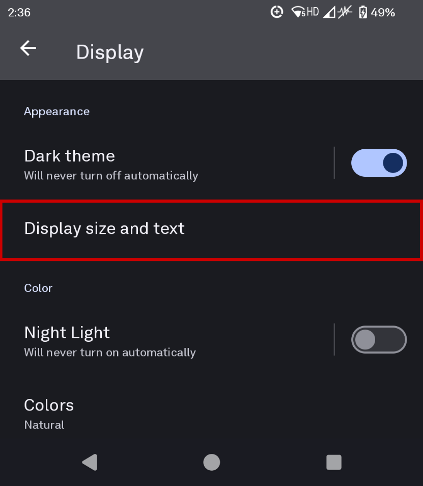

3. Find 'Font Size' and 'Display size'. Make sure they are at the smallest size possible.

    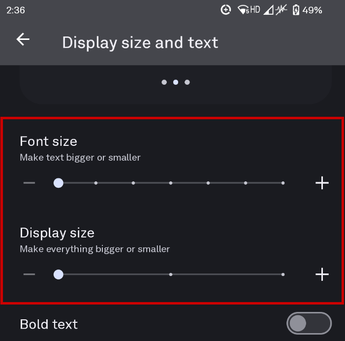

# Enabling lock screen

Referencing my earlier analogy on the importance of securing your device, this will show you how to enable the lock screen on Android. If you are running Hybrid mode as well, I highly recommend that you disable the lock screen PIN on LightOS (if enabled) and use only the Android lock screen. This way the phone is secure but you don't have to unlock both Android and LightOS. For Full Android Users, you will only need the Android lock screen.

```
Settings > 'Security' > 'Screen Lock' / 'Fingerprint'
```

1. In Settings, navigate to 'Security'.

    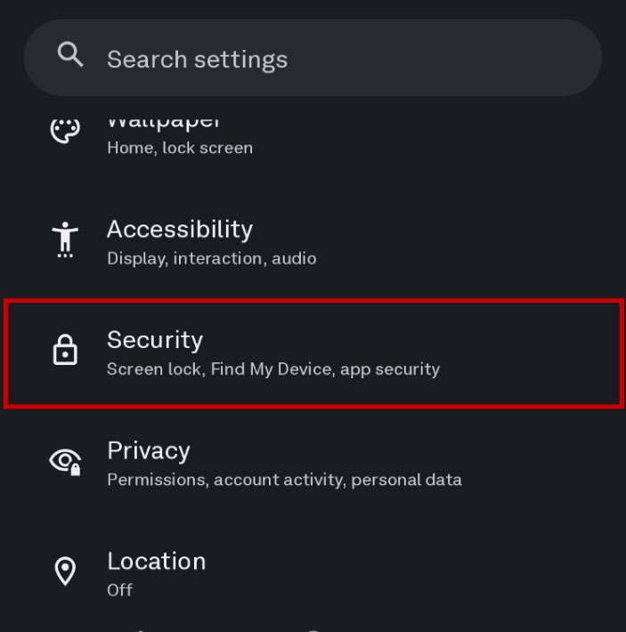

2. In 'Security', select 'Screen Lock' to enable a PIN or Pattern.

    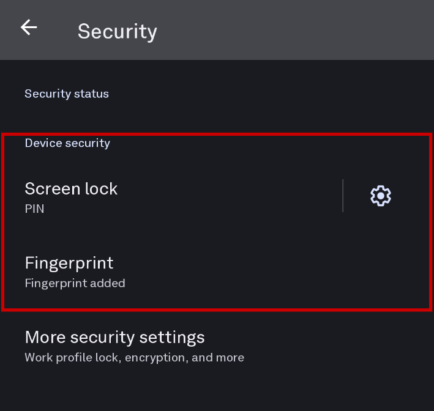

3. You also have the option to enable biometrics for the fingerprint scanner here as well.

# Notifications

This is especially applicable to those running in Hybrid Mode, although I use it as well in Full Android. The motor for the vibration on the Light Phone III isn't great, so I'll sometimes still miss important notifications, and there are some cases where I can't have the ringer on, but still want to be notified of something on my phone. If you're running Hybrid Mode and are missing key UI elements, such as the notification bubble, you may want to have the screen and/or flashlight flash to notify you.

1. In Settings, find 'Notifications'.

    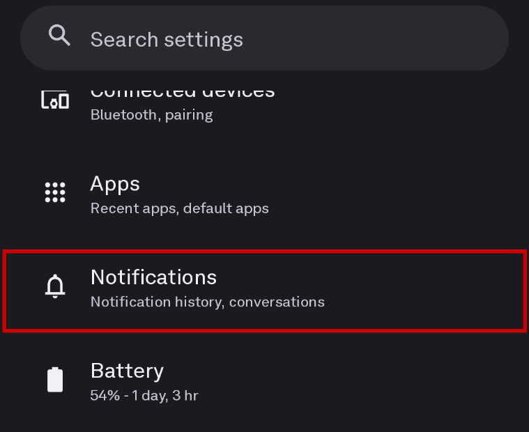

2. Find 'Flash notifications' and select it.

    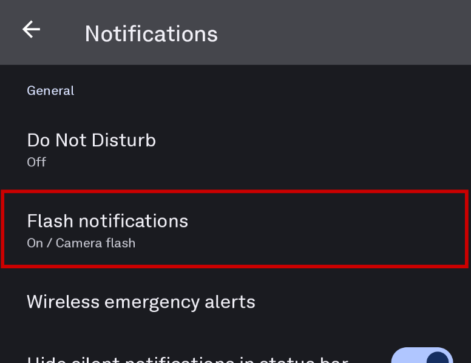

3. You'll have the options to select 'Camera flash', 'Screen flash', or both.

    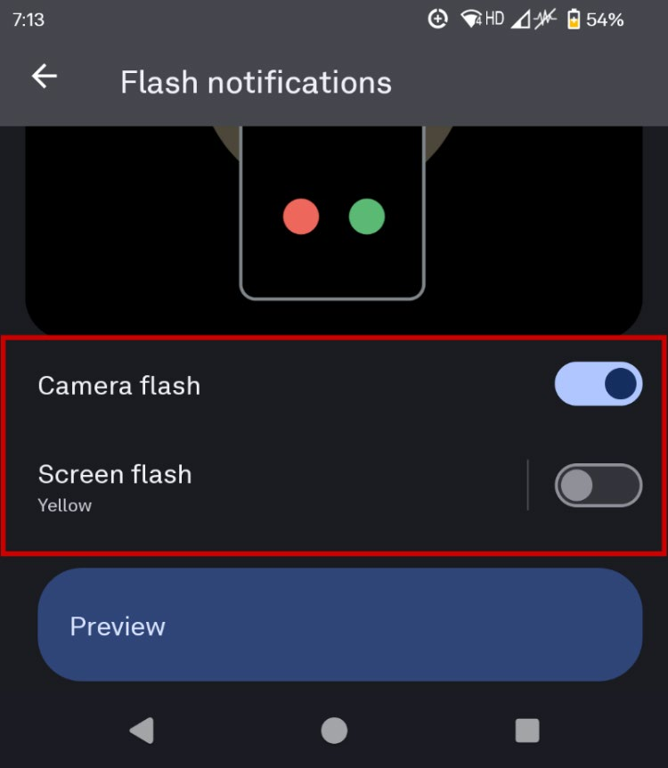
