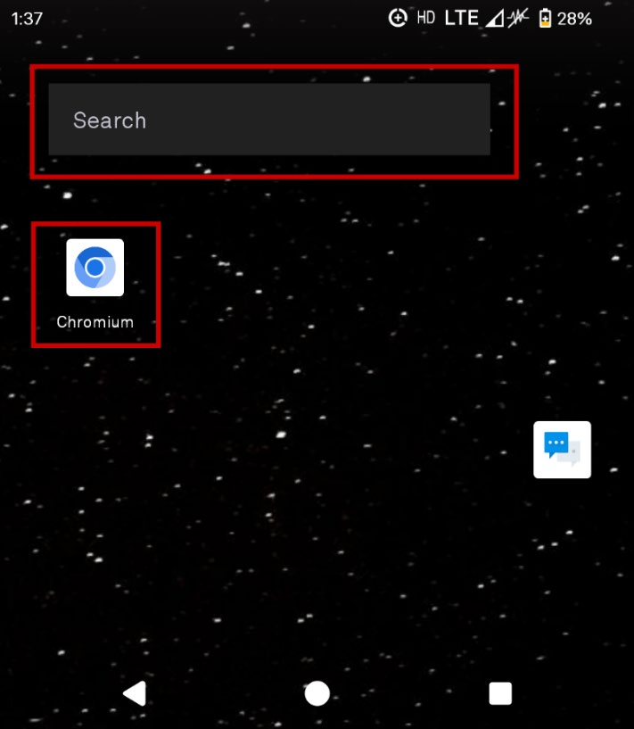
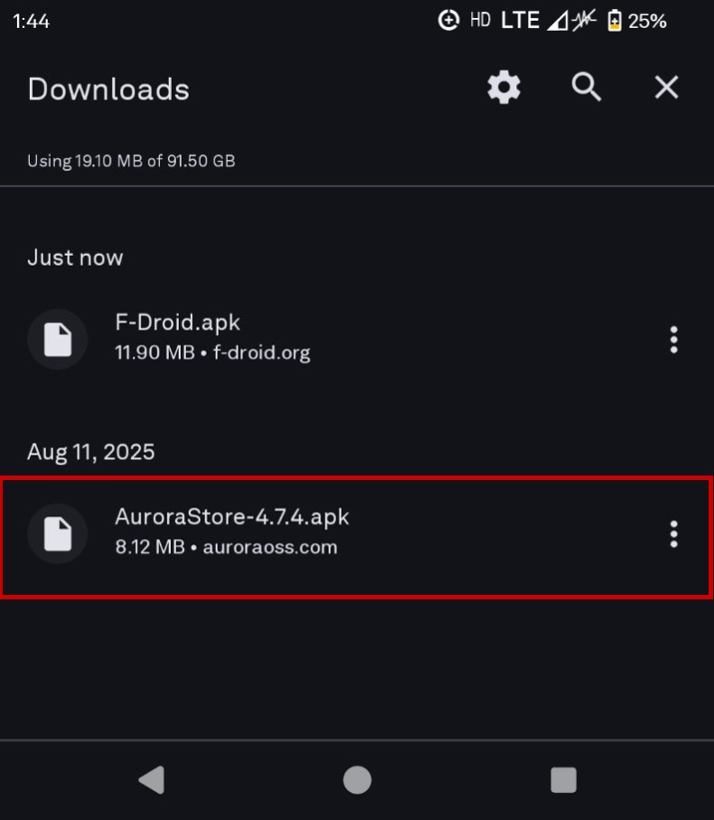
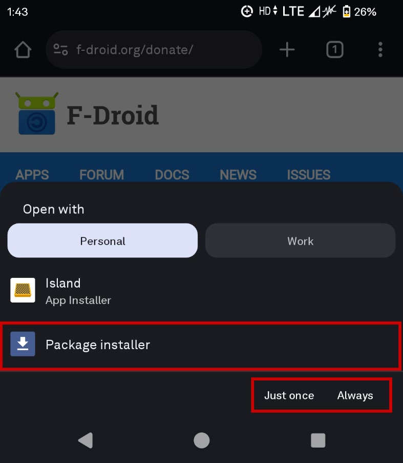

This version of Android 14 runs completely de-Googled. This means that there are no Google apps pre-installed on the device. We are given a bare bones Android with basic functionality. In order to install more applications on the device, we'll need to source the .apk from the developers and/or use a client.

# Clients

If you're going to install applications, the most common way is through an app store. Aurora is an absolute must for the majority of people. For free and open-source software (FOSS) or open-source software (OSS), you have a few options to choose from.

## Aurora Store

Aurora is a FOSS (free and open-source software) client for the Google Play Store.

For proprietary non-FOSS applications (i.e. Discord, WhatsApp, Apple Music, Spotify, etc.) you will need the Aurora store. Anything that you would normally find on the Google Play Store will be here, however, there is no guarantee that it will work on the LP3. There is a mega thread on r/ModifiedLightPhones that details some of the known applications that work on the LP3.

In this section, I'll show you how to download Aurora Store via the device itself.

1. Navigate to the QuickStep home screen.
2. Find Chromium (or use the Google search bar) and open it.

    

3. Search for '**Aurora Store**' or type in the following link: **https://auroraoss.com/files**
    a. Dir: `/ downloads / AuroraStore / Release`
4. Download the **latest** .apk and wait for the download to finish. You can find the downloaded file in the downloads tab within Chromium.
5. Tap on the .apk file.

    

6. Open the .apk with 'Package Installer'.

    

7. You will receive the following prompt saying Chromium 'isn't allowed to install unknown apps from this source.' Tap 'Settings'.

    

8. Enable Chromium to install unknown apps.

    

9. Let **Aurora Store** finish installing.

## FOSS clients

For free and open-source software (FOSS) or open-source software (OSS) apps and their respective repositories need to be sourced via an app store (see below), through Obtainium or downloading the .apk and installing through the default Android Package Installer.

FOSS/OSS repos can be sourced from the following store clients:

- **F-Droid**
- **Droidify**
- **IzzyOnDroid**
- **Accrescent**
- **Komi Store** (previously GitHub Store)

## Obtainium

Obtainium is not _absolutely_ necessary but is incredibly useful in keeping applications updated that were sourced from the GitHub repos directly.

Developers will often push updates, fixes and releases to their GitHub repos without notifying existing users. Updates will typically be pushed to GitHub first before ending up on clients such as F-Droid. Sometimes applications can be updated via the client directly (even if downloaded from GitHub) but often, applications are not available on those repo clients.

All community-made tools for the LP3 are recommended to be downloaded via Obtainium as this will allow them to stay updated frequently as developers frequently push out new fixes and releases. A list of current community-made Light tools can be found **HERE**.

# Google

One of the things I mentioned earlier was that the phone does not come with anything Google made. Some applications require Google Framework Services to run and operate, some don't. Anything in the Google Suite of applications will inevitably need microG (formerly known as revanced) to run. The only caveat to that is that microG will only work on the Light Phone III with minimal functionality. Without a root, you cannot use microG to its full extent. This is due to signature spoofing issues.

While running in Full Android, I did notice that I had encountered a bug with Google Framework Services. It was continuously crashing after ~4 hours and would reboot the phone. Uninstalled it, ran logcat to monitor and had no issues afterwards. You may not have issues, but it is something to keep in mind.

## Google Framework Services

The .apk for Android 14 Google Framework Services can be found here via APKMirror.

**microG:**

The .apk for microG (formerly known as revanced) can be found here via vanced.

For the time being, it may be beneficial for you to look into FOSS applications in place of Google's suite of applications since they can't / won't work correctly or to their full extent. You're more than welcome to play around with Framework Services and microG to find a compromise to suit your needs.

# Launchers

Similar to LightOS's React Native launcher app, Android also employs the use of launchers for their home screen. Home screen and launcher can be used interchangeably. You're more than welcome to use the built-in QuickStep, however, I have a few launchers that are note-worthy and others that are not suitable for the Light Phone. At the end of the day, test out some of the launchers below to see if you like them.

## Luma

Luma is a Kotlin-based Android launcher application that uses a fork of OlauncherCF inspired by inkOS. It takes inspiration from the aesthetic design of LightOS and implements other features that would be desired from Light Phone users.

Brief list of features, as noted in this reddit post by vandamd:

- Tiny file size (< 3 MB)
- Ability to rename applications
- Hiding apps from the app drawer
- Up to 5 pages on the home screen, where each page can have 1-6 applications
- Notification indicator (`*`)
- Ability to show / hide page indicator as well as change alignment from left / right
- Gestures for actions (i.e. open app, show notifications, show recent apps, show quick settings, etc.)
- Similar haptics as used in LightOS
- Similar font to LightOS (Public Sans)

I have nothing but kind words for Vandam. This launcher perfectly embodies the LightOS aesthetic but still retaining core user customisation that is not available in LightOS itself. For those who are into minimal launchers but love LightOS's graphic design, this would be the first launcher I point them to for Android. On another note, it also works for other Android devices, not just the Light Phone.

Luma can be downloaded here via GitHub.

### Luma Strict

Locked down fork of Luma that prevents access to Luma settings. Requires keyboard combo `CTRL + G` to access settings.

Luma Strict can be downloaded here via GitHub.

### Luma 2.0

Luma 2 is a dedicated launcher outside of Luma (1) that combines both LightOS tools and Vandam's community tools. It implements a similar dashboard to Light's (https://dashboard.noscroll.ing/). Through the dashboard, you are able to show LightOS tools, Vandam's No Scrolling tools and any other applications installed via the Android layer.

For privacy purposes, there is no email or password required but you will need to generate a 16 digit account ID.

Do keep in mind that this version of Luma is an early pre-release build. Bugs are to be expected as it is not a stable release build.

Brief list of features:

- Gesture actions on the lock screen
- Enabling dedicated keymaps
- Ease of switching between LightOS and the Android layer
- Both LightOS tools and Android apps will appear within the same home screen launcher
- Reduced battery consumption

Luma 2 can be installed via Obtainium by including pre-releases in additional options when installing or updating the main Luma app.

## Before Launcher

Before Launcher is a minimal launcher app that is similar in nature to LightOS. It is designed to reduce distractions and help you use your phone less.

Brief list of features:

- Minimal homescreen with no ads
- Customise the look of the launcher
- Fast access to favourites and one swipe to access app drawer
- Favourites, folders and the ability to hide apps
- Hide unnecessary notifications
- Easy set-up
- Widgets
- Ability to remove anonymous analytics

Initially, I used Before Launcher while following the original modding guide. It is a simple, minimal launcher with minimal permissions. It allows you to customize the home screen in more sleek and modern look, with the ability to add widgets at the top for time, date, weather, etc. You are able to view notifications on the home screen without needing to view the status bar.

Before Launcher can be downloaded via Aurora.

## Olauncher

Olauncher is a minimal ad-free (AF) launcher with just enough features for functionality but to help keep the home screen as minimalist as possible.

Brief list of features:

- Minimalist homescreen with no ads
- Customisations that include resizing text, renaming apps, hiding unused apps, show / hide status bar, app text alignments, etc.
- Gestures including double tap to lock, swipe gestures, etc.
- Wallpaper customisation that can either be a new daily wallpaper or your own
- FOSS Android launcher that has no trackers via Exodus

I found Olauncher to be a solid contender for the Android launcher, however, I found it had a weird aspect ratio and while the customisations are great, they are not optimised for the Light Phone and therefore you may have some issues getting it right for your own use case.

Olauncher can be downloaded via Aurora and F-Droid.

## Square Home

Square Home is a tile-based launcher that takes massive inspiration from Microsoft 8's tile UI, but easier to use. It can be used as minimally or as maximally as you wish.

Brief list of features:

- Vertical scrolling and horizontal scrolling from page to page
- Tile effects
- Shows notifications and count on tile
- Smart app drawer
- Customisation including but not limited to: tile colours, tile size, tile icons, tile names, widgets, app folders, wallpapers, etc.

This is absolutely a love-or-hate-it kind of launcher. I found that it took the best of Microsoft 8's tile UI and made it better, but I really had to keep an open-mind while trying it out. I didn't mind using the launcher and I adored the amount of customisation that came with the launcher but ultimately moved away from it for my own use case.

Square Home can be downloaded via Aurora.

## folder launcher

folder launcher is a file structure / directory inspired launcher.

Brief list of features:

- A minimal folder based launcher
- Widgets with customisable bounds
- App icon support
- App renaming
- Custom wallpaper support

I used folder launcher for a week or so and I believe it has potential, but doesn't quite hit the mark for me. It is a simple, privacy-friendly and FOSS launcher that uses folders as its primary way of organising the home screen and navigating it. I enjoyed the customisation for apps, although there was a bit of a learning curve when it came to understanding the bounds of widgets. Swipe gestures were finicky, no app drawer available and navigating settings had a learning curve to it as well. I do greatly appreciate the nod to directory navigation.

folder launcher can be downloaded via F-Droid.

## Ion Launcher

Ion Launcher isn't a minimal launcher but it can be customised to be one. It is designed as a beautiful, functional and customisable launcher.

Brief list of features:

- Shows only relevant information on the home screen and organises your apps in the app drawer based on categories
- Customisation of the wallpaper, icons, app names and other settings
- Ergonomic where elements are arranged in a way that makes the phone optimal to use for reachability and muscle memory
- Lightweight and fast, designed to take up as little storage as possible (within reason)

I used Ion Launcher only briefly. I liked the customisation of the launcher, apps and the home screen, however it is not optimised for the Light Phone III. I had some issues changing some of the customisation settings to make it more minimal, and thus, I ended up moving away from it.

Ion Launcher can be downloaded via F-Droid.

## Niagara Launcher

Niagara Launcher takes a minimal launcher and makes it easily accessible with one hand and aims to reduce screen time.

Brief list of features:

- Ergonomic efficiency to use everything with one hand
- Adaptive list for important notifications such as incoming messages, calendar events etc. and adjusts based on your usage
- Embedded notifications on the apps
- Ad-free
- Lightweight and fast
- Material You themes
- Personalisation and customisation with icon packs, fonts, wallpapers, etc.

I have not personally used Niagara but I have heard good things about it, especially in the market for minimal launchers.

Niagara Launcher can be downloaded via Aurora.

## inkOS

inkOS is a text-based minimalist launcher that was optimised for Android-based devices as well as e-ink displays.

Brief list of features:

- Gestures for double tap, swiping, clock / date
- Top and bottom margin control
- Audio playing widget
- Date, clock and battery widgets
- Custom wallpaper
- System shortcuts
- App and notification drawers
- Notification icons on applications on home screen
- Multiple pages and user defined number of apps + reordering

inkOS was originally designed for the Mudita Kompakt but can be used on any Android device and has specific options for those using e-ink devices. It does not have infinite scrolling and I found the launcher to be a tad bit compact for the Light Phone, but other Light Phone users in the community praise it as an alternative to LightOS.

inkOS can be downloaded here via GitHub.

# FOSS alternatives

What do we do about the AOSP or missing applications that we may need on the Android side? You have the option to try and replicate any missing Google applications with the help of this section, however, I want to also present another alternative – FOSS.

There's quite a few apps that replace AOSP or Google-based system apps, as well as some others that you may not have realised were missing. My personal preference is to use the Fossify suite of applications although the Right suite of applications can be used too as both Fossify and Right are FOSS forks of the once FOSS Simple Tools suite of applications, all of which can be downloaded via F-Droid.

- Breezy Weather
- Weather by Vandamd
- CoMaps
- Fossify Calculator
- Fossify Calendar
- Fossify Clock
- Fossify Contacts
- Fossify File Manager
- Fossify Gallery
- Fossify Music Player
- FlorisBoard
- FUTO Keyboard
- HeliBoard
- MJ PDF (pdf viewer)
- Notesnook
- Open Camera
- Organic Maps
- Passes by Vandamd
- PipePipe (YouTube client)
- QUIK SMS or Fossify Messaging
- VLC (audio and media player)
- Right Dialer
    - I use this as my dialer as it is the only dialer app that I could find that works with the Light Phone screen aspect ratio without breaking other apps and still retains the call UI.
- OsmAnd (maps)
    - I do not personally use this as it has a large learning curve and is particular but does provide an alternative to Google Maps.
- Fossify Phone
    - I used this on my smartphone, but unfortunately, it is not optimised for the Light Phone. The general UI works except during calls where the icons for call functions are missing but can be changed with display font size.

# Additional applications

Here I will share the necessary applications I use for functionality of the phone, whether in Hybrid or Full Android Mode. I have included lists of other apps I currently use on my Light Phone as well. I purposefully made it a point to keep the phone utility-based, despite running Full Android and having full capability of the phone. Can it run social media apps? Yes, but not well. I would recommend keeping the phone for utility only since the screen makes optimisation awful for the aspect ratio and in lacking a root for full microG support, it makes some applications behave weirdly. These are what I use or have used, but it's entirely up to you with what you want to install and use.

## Community-made Light tools

Following the release of the Light SDK, lots of developers are working on building their own tools for the community. This list includes tools included on the awesome light website as well as other tools released by the community.

All community-made tools for the LP3 are recommended to be downloaded via Obtainium as this will allow them to stay updated frequently as developers frequently push out new fixes and releases.

### Communication

- **Molly Light** (jabberbox)
    - A DIY minimal LightOS-esque reskin of Molly (a hardened, open-source fork of Signal).
    - Source
    - Download
- **Morse** (vandamd) — _UNRELEASED_
    - A LightOS-esque reskin of the Beeper client for the Light Phone III. Supports Signal, Telegram, WhatsApp and iMessage. Currently in development.
    - Source
    - Download

### Entertainment

- **Passatempo** (tyshi00)
    - A small games tool for LightOS, built with the Light SDK. Eight things to do: Snake, Brick Breaker, Pong, Tic-Tac-Toe, Connect Four, Sudoku, Word Search, and Dice. Formerly called "Games" - renamed to Passatempo (Portuguese/Italian for "pastime"). Each game has a daily budget to prevent you from spending too much time on the device.
    - Source
    - Download

### General

- **Unofficial Light Phone API/CLI/TUI** (garado)
    - An unofficial, community-maintained Python API and CLI/TUI for managing music, notes, podcasts, and tools on Light Devices. This was made by reverse-engineering the API endpoints from the official Light Dashboard.
    - Source
    - Download

### Keyboard

- **Emojis** (zacksimpson)
    - An emoji picker for the LPIII. All Android 14 emojis are organised by category and searchable. Emojis can be copied to your clipboard and customised to show most recent or most used.
    - Source
    - Download
- **Keyboard** (adam-weber)
    - A clone of the Light Phone 3's built-in keyboard, for any app with optional auto-correct and voice dictation that are fully local on the device and private. Ability to swipe down to hide the keyboard.
    - Source
    - Download
- **Type** (KEZO555)
    - A faithful recreation of the Light Phone 3 keyboard built on Keyboard by adam-weber, as a system keyboard for any app. Includes additional languages: English, Hebrew, Spanish, French, German, Italian, Portuguese, Arabic, Mandarin (QWERTY pinyin), Dutch (QWERTY + Belgian AZERTY), Russian and Polish – each with its own layout and long-press accents.
    - Source
    - Download

### Launchers

- **Luma** (vandamd)
    - A minimal launcher for the Light Phone III with configurable swipe + tap gestures, hide apps from drawer, rename apps, shortcut pinning.
    - See also: Luma Strict, Luma 2.0
    - Source
    - Download

### Music/Audio

- **Bard** (sjkornelsen)
    - A minimalist, text-only audiobook player designed for the Light Phone III. Includes local audiobooks, optional Libby loans, and optional RSS audiobooks into one calm Books screen and one consistent player interface.
    - Source
    - Download
- **Echo** (vandamd)
    - A minimal Spotify client for the Light Phone III that requires Spotify to be installed locally on the device.
    - Source
    - Download
- **NTS Radio** (vandamd)
    - An app to play NTS Radio Live shows and Infinite Mixtapes.
    - Source
    - Download
- **Phono** (jonathancaudill)
    - An independent, minimal Spotify client for LightOS with less album art. Playback runs in-process via a patched fork of librespot (Rust). Metadata (search, library, albums, artists, playlists) uses the official Spotify Web API with your own developer-app credentials. Does not require Spotify to be installed locally on the device but does require a premium Spotify account.
    - Source
    - Download
- **Reverb** (vandamd)
    - A local music player for the Light Phone III with high resolution playback that allows you to like songs, create playlists and display song lyrics.
    - Source
    - Download
- **Tunes** (dryane)
    - A minimal music app for the Light Phone III with automatic music detection.
    - Source
    - Download

### Navigation

- **Buses** (vandamd)
    - An app for the Light Phone III to track buses in the UK. Includes bus stop search and bookmarks, services and live timetable, live map of buses and available seat capacity.
    - Source
    - Download
- **Topographic** (garado)
    - An outdoor maps app for the Light Phone III powered by OpenStreetMap. Includes map with layers for trails, road, topographic contours, waterways and labels, displays current GPS location with compass directional indicator, GPX routes for navigation and the ability to create and edit map markers from the map or manually.
    - Source
    - Download
- **Logger** (vandamd) — _UNRELEASED_
    - Route logger for the Light Phone III in development.
    - Source
    - Download

### Camera/Photos

- **Zero** (vandamd)
    - A camera app for the Light Phone III that fixes latency issue with the LightOS camera tool. Allows .jpg and .raw DNG output files, manual and auto exposure, composition grid, image preview after capture, optical image stabilisation (OIS), B&W image mode.
    - Source
    - Download
- **Photo Backup** (sjkornelsen)
    - A minimal back-up tool for the Light Phone III that discovers eligible photos and appends them to the connected user's Google Photos library. It has no gallery, thumbnails, previews, downloads, deletion, or Google Photos browsing. It works without Google Play Services.
    - Source
    - Download

### Productivity

- **Checklist** (ak-nattyb)
    - A simple checklist app with list-based organization for Light Phone users with Markdown capability and colour inversion.
    - Source
    - Download
- **Composer** (zacksimpson)
    - A notes tool for the Light Phone III with Markdown capabilities.
    - Source
    - Download
- **Luminous Strategies** (ak-nattyb)
    - An app that lets you choose a card from Brian Eno's Oblique Strategies to inspire your creativity.
    - Source
    - Download
- **Recall** (ChopinDavid) — _UNRELEASED_
    - An Anki-compatible spaced-repetition client for the Light Phone III built with the Light SDK. Allows you to study your due Anki cards. Features deck creation, editing and browsing stay on the device.
    - Source
    - Download
- **Reminders** (zacksimpson)
    - A reminder tool for the Light Phone III that can organise tasks into lists, add due dates and times, check things off as you go and get notified when it matters.
    - Source
    - Download

### Utility

- **Backlog** (Alexis-NM)
    - A minimal, LightOS-inspired video game tracker for the Light Phone III — a stripped-down Backloggd experience. Track your games by status, rate them, browse by console, write them into custom lists, and read game descriptions & screenshots — all in a distraction-free black & white interface. Game data comes from IGDB (by Twitch).
    - Source
    - Download
- **Bible** (cmg-ops)
    - An offline Bible app for the Light Phone III with downloadable translations, bookmarks, saved verses and full-text search.
    - Source
    - Download
- **Bible** (greghare)
    - A simple, distraction-free Bible reading app for the Light Phone III, with ESV text and audio, verse highlighting, search and optional light/dark mode.
    - Source
    - Download
- **Botany** (greghare)
    - A plant identification tool for the Light Phone III: point it at a plant, snap a photo, and get its common name, scientific name, and family via the Pl@ntNet API. Save identifications by adding plants to your Collection. Includes over 50,000 identifiable species and location field settings.
    - Source
    - Download
- **Dictionary** (garado)
    - A simple offline dictionary app with word pronunciation and saving words for later review.
    - Source
    - Download
- **Light GPSLogger** (garado)
    - A Light Phone III-style reskin of GPSLogger that logs GPS information to various formats (GPX, KML, CSV, NMEA, Custom URL) and has options for uploading (SFTP, OpenStreetMap, Google Drive, Dropbox, Email).
    - Source
    - Download
- **Lists** (cmg-ops)
    - A DailyHobbyist tool built for the Light Phone III. Offline, expandable, infinitely nestable lists — every item can open into its own list, as deep as you want.
    - Source
    - Download
- **MediLight** (ruditimmermans)
    - A medication app that helps you keep track of your medications and remember to take them. All user data is stored locally on the device.
    - Source
    - Download
- **Metronome** (garado)
    - A minimal metronome app for the Light Phone 3. Includes editable BPM with incremental adjustment buttons, downbeat emphasis, note subdivisions and haptic feedback.
    - Source
    - Download
- **Nourish** (zacksimpson)
    - A mindfulness-first daily check-in tool and meal logger for the Light Phone III.
    - Source
    - Download
- **Paka** (janovsk1s)
    - Offline pass wallet and TOTP authenticator for the Light Phone III. Stores barcodes, PDFs, document photos and 2FA codes locally on the device. Includes support for QR, Aztec, PDF417, Data Matrix, GS1 and linear barcodes.
    - Source
    - Download
- **Passes** (vandamd)
    - An app for the Light Phone III to store and scan various codes including QR, Aztec, EAN-13, EAN-8, PDF417, UPC-E, Data Matrix, Code 39, Code 93, ITF-14, Codabar, Code 128 and UPC-A.
    - Source
    - Download
- **Pokey** (jabberbox)
    - A personal GLP-1 injection and weight tracker for the Light Phone III. Includes shot and weight logging, history, goal tracking, imperial and metric toggles and a 7-day countdown.
    - Source
    - Download
- **Ritual** (KEZO555)
    - An AeroPress recipe guide for the Light Phone III. Includes browsing recipes by category, full brew specs and a brew timer.
    - Source
    - Download
- **StopWatch** (cmg-ops)
    - A stopwatch tool for the Light Phone III that has laps, best/slowest lap tracking and a history of past sessions.
    - Source
    - Download
- **Strings** (garado)
    - A minimal chromatic tuner for the Light Phone III with an adjustable reference pitch and adjustable note display.
    - Source
    - Download
- **Tracker** (tyshi00)
    - A tiny health tracker for the Light Phone III — just a simple way to keep tabs on your water intake, sleep, steps, and (if it applies to you) your cycle, without any distractions.
    - Source
    - Download
- **Verses** (zacksimpson)
    - A focused Bible reading tool for the Light Phone III, built with the official Light SDK. Includes full access to any verse or passage, Verse of the Day, multiple translation support and add notes for reference.
    - Source
    - Download
- **Weather** (vandamd)
    - A weather tool for the Light Phone III using the Open-meteo API. Includes current weather conditions, hourly and weekly forecasts, search and save multiple locations, customisable units between imperial and metric (temperature, precipitation and wind speed), current location support.
    - Source
    - Download

## Security and privacy

- Aegis (2FA) (via Aurora or F-Droid)
- KeePassDX / KeePassDroid (via Aurora or F-Droid)
- Ente Auth (via F-Droid)
- Bitwarden (via Aurora)
- NetGuard (via Aurora)
- Mullvad VPN (via Aurora or F-Droid)

## Internet

- Brave (via Aurora)
- Mozilla Firefox (alternatives include IronFox and Fennec) (via Aurora for Fennec or via GitHub for IronFox)

## Travel / Media

- Waze (works without Google Play Services but is owned by Google) (via Aurora)
- Spotify (via Aurora)
- HERE We Go (via Aurora)

## Functionality (not optional)

- Volume Styles (via Aurora) (primarily for Hybrid Mode)
- Key Mapper (via Aurora or F-Droid) (Hybrid and Full Android Mode)
- MacroDroid (via Aurora) (Necessary for Hybrid Mode, optional for Full Android)

## Communication

- Signal
- Simplex (optional)
- Briar
- WhatsApp (via Aurora)

## Isolation

- Insular (fork of Island) (via F-Droid)
- Greenify (via Aurora)

## Email

- Proton Mail
- Tuta Mail

The isolation one is a bit strange. I currently run any of my apps that are known to track in a sandbox. I use Insular, which is a fork of Island, to enable work profiles on Android. This allows me to clone applications to a separate part of the phone where they can function normally, but don't have access to anything on the 'mainland'. This is for privacy purposes and completely optional.
