I will always emphasize the use of Full Android mode in terms of customisation, user functionality and battery life. Without LightOS running, you won't have an additional app constantly running in the background and draining the battery further. You have more ability to customise the phone to your use case without Light being involved.

For Full Android, you will want to follow the guide in this order:

1. [How to Access the Android Layer](/resources/modding-guide/how-to-access-the-android-layer/)
2. [Developer Options](/resources/modding-guide/developer-options/) (Android and / or LightOS)
3. [Setting Up Android](/resources/modding-guide/setting-up-android/)
4. [Key Mapper](/resources/modding-guide/key-maps-and-macros/#key-mapper)

Everything else in this guide is meant for you to tailor to your own use, and trying out launchers, applications, keyboards, etc. is encouraged to all users. I can give some recommendations, but there is so many apps, key maps and macros that can all be customised to your own preferences.

Before starting, I want to stress the importance of following this section's directions to enable Full Android mode in order and understand the instructions fully. Re-iterating my warning from the preface:

> [!CAUTION]
> In terms of liability, I am not liable if you mess up and/or brick the device. I have tried to make this as idiot-proof as possible to minimise the risks involved, but if you do something wrong, I am not at fault for it. There is a risk to modding a phone, especially in terms of jailbreaking or even delving into the lower levels of the API.
>
> **IF you do not understand the more advanced parts of this guide, do NOT attempt them. If you do not have an understanding of what you are doing, you are far more likely to break something.**
>
> Additionally, per [this comment from Joe Hollier via Reddit](https://www.reddit.com/r/LightPhone/comments/1jxtw0j/comment/mpvx94e/), Light deems use of the Android layer that results in a bricking or breaking the device as voiding the warranty of the phone. Know the risks involved and proceed with caution.

Once you understand the risks involved, we can get started.

# Global setting: light_mode

I highly recommend you change `light_mode` first, before disabling LightOS. There seems to be a couple of issues enabling `light_mode` once LightOS is disabled. The most reliable way is via Change Launcher in LightOS developer settings, but I will include the adb commands for it as well.

## What is light_mode?

`light_mode` is a global setting that hides certain UI elements i.e. heads up notifications, call UI, status bar and button navigation. If you're going Full Android, you will absolutely want this setting enabled (disabled via LightOS) so you don't need specific macros to see these elements and be able to interact with them like a normal Android device.

For Hybrid Mode users, this is necessary for enabling Bluetooth pairing and adding, as well as some Wi-Fi connections.

## Change Launcher

If you haven't already, enable LightOS developer options. You can find instructions on how to do so **[HERE](/resources/modding-guide/developer-options/#lightos)**.

> [!NOTE]
> 'Change Launcher' is only able to be accessed through LightOS Developer Options. As of [Firmware v.1.440000](https://support.thelightphone.com/hc/en-us/articles/360031105751-Software-Versions-Change-Log), access to LightOS Developer Options is no longer possible as the factory version is now reverted to v52x or higher. If you have already enabled LightOS Developer Options prior to Firmware v1.440000, you will still be able to access these settings.



1. In LightOS settings, find and select developer options.

    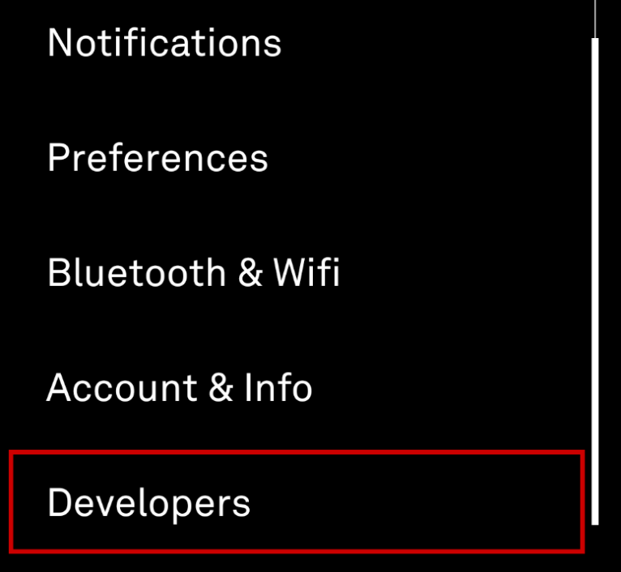

2. Find and select 'Change Launcher'.
    a. This will reboot the phone to Android.

    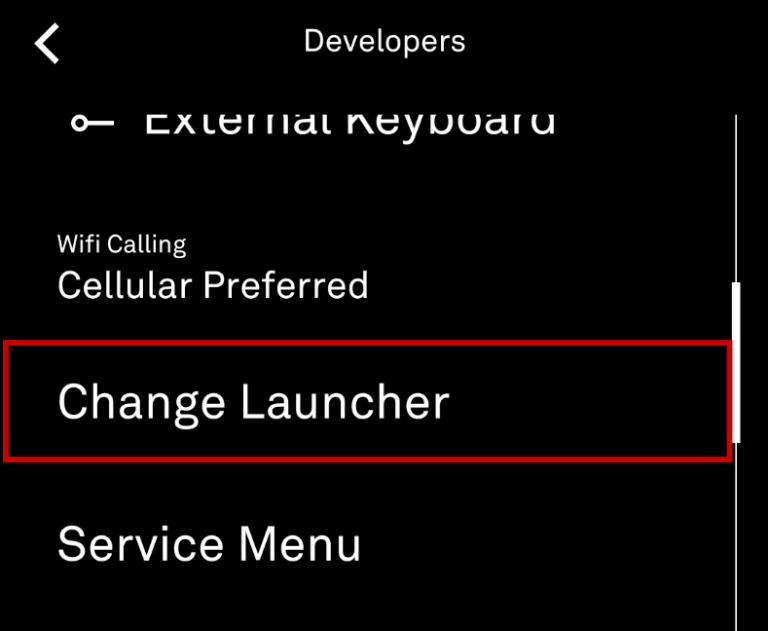

3. You will then be prompted to change your default home app to the one of your choice.
4. Once fully booted into Android, you should be able to see the status bar.
5. Go ahead and change your other default apps to AOSP or any alternative applications you like as well as changing navigation if you wish.
    a. You can click **[HERE](/resources/modding-guide/setting-up-android/#default-applications)** to jump to 'Default Applications' if you are unsure of how to do so.
    b. You can click **[HERE](/resources/modding-guide/setting-up-android/#gesture-navigation)** to jump to 'Gesture Navigation', if you are unsure of how to change navigation settings.



## ADB

What you will need:

- Light Phone III
- Computer with adb OR Shizuku/aShell installed
    - To set up adb, you can click **[HERE](#adb-via-android-sdk)** for SDK adb or **[HERE](#adb-via-shizukuashell)** for Shizuku/aShell

Running the following command will list all global settings, which should include `light_mode`:

```
/adb shell settings list global
```


We're looking for the following global setting:




1. Run the following command in adb:

    ```
    /adb shell settings put global light_mode 0
    ```

    a. Note that running the command will not output any results.

    

2. We can also run the following command to verify `light_mode` is 0:

    ```
    /adb shell settings get global light_mode
    ```

    a. Running any `get` command will output the current setting.

    

3. Reboot adb.

    ```
    /adb reboot
    ```

    a. This will reboot the phone.



# Disabling LightOS

What you will need:

- Light Phone III
- Computer with adb OR Shizuku/aShell installed
    - For adb: You can download Android SDK **[HERE](https://developer.android.com/tools/adb)** either as part of SDK manager or as the standalone Android SDK Platform Tools package.
    - For Shizuku/aShell: You can find the installation process and use **[HERE](#adb-via-shizukuashell)** in the modding guide.
- Reliable USB connection
    - If using adb on a computer, I recommend using the braided Light Phone USB-C cable that came with your phone if you have a USB-C data port or a simple USB-C to USB-A cable.

## ADB via Android SDK

What you will need:

- Light Phone III
- Computer with adb
- Reliable USB connection



1. Connect your Light Phone III to your computer via USB.



### On Android



2. In the notification shade, you should have a notification showing the device is connected via USB.
3. Tap the notification for more options.

    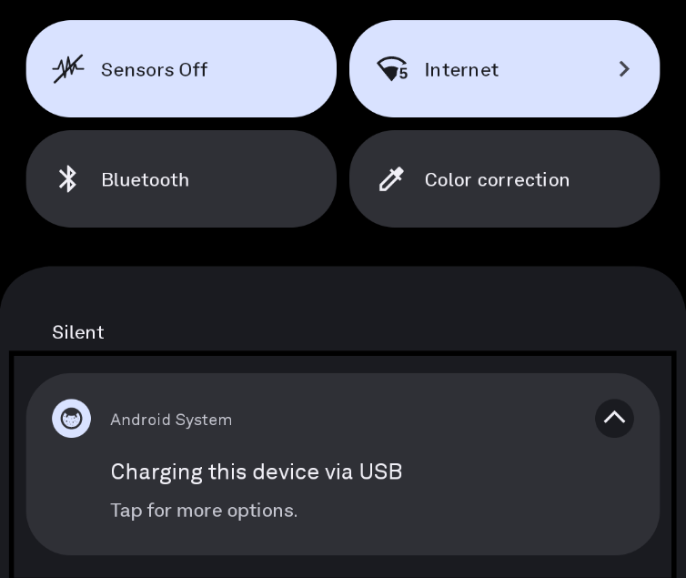

4. Verify the USB preferences are as follows:
    a. USB controlled by: _This Device_

    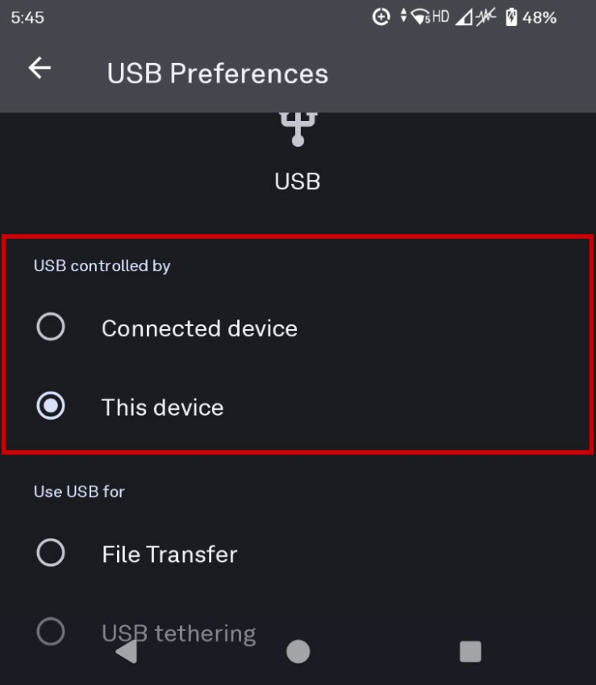

    b. Use USB for: _No data transfer_

    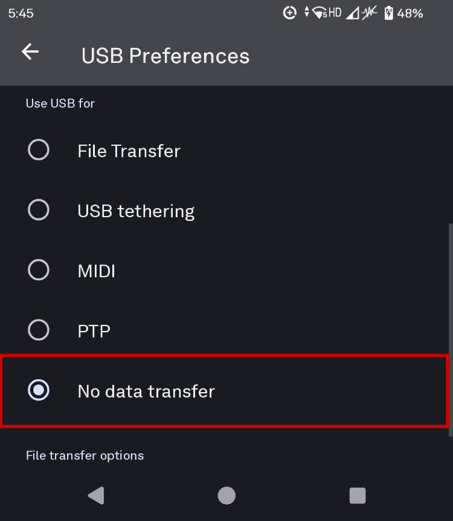

```
Settings > System > 'Developer Options' > 'USB Debugging'
```

5. Navigate to Settings.
6. Find and select 'System'.

    

7. Find and select 'Developer Options'.

    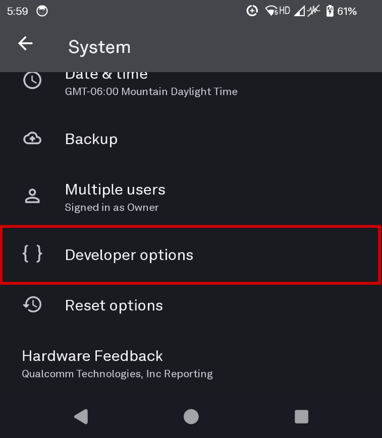

8. Find and select 'USB Debugging'.
    a. We need this enabled in order for the phone to be recognised by your computer.

    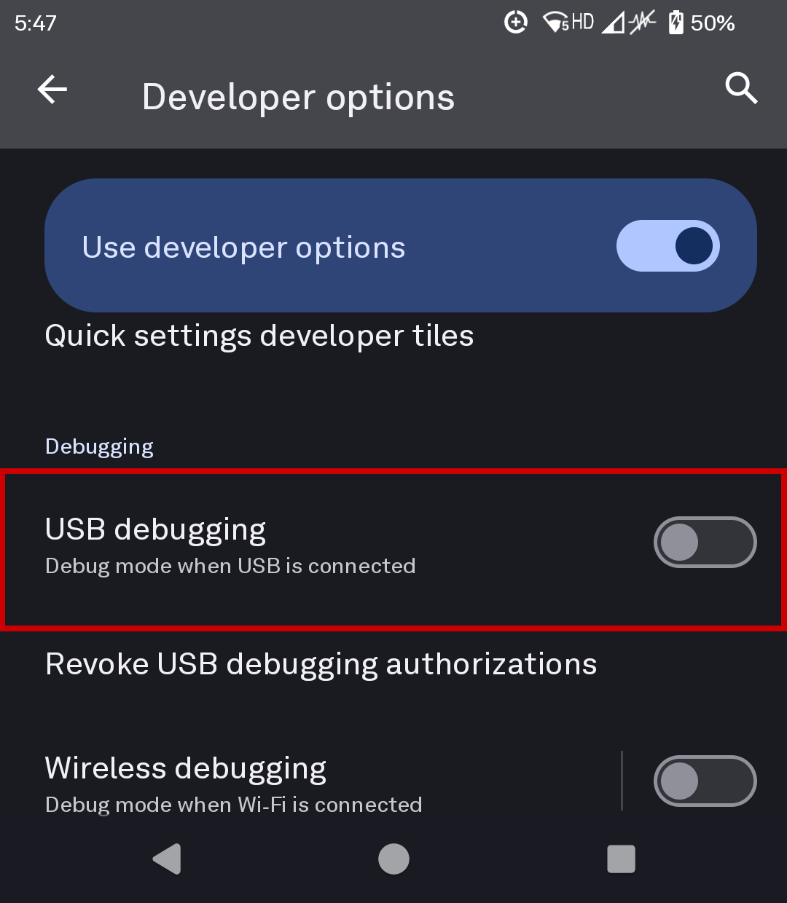

9. In the prompt, select 'OK' to allow USB debugging.

    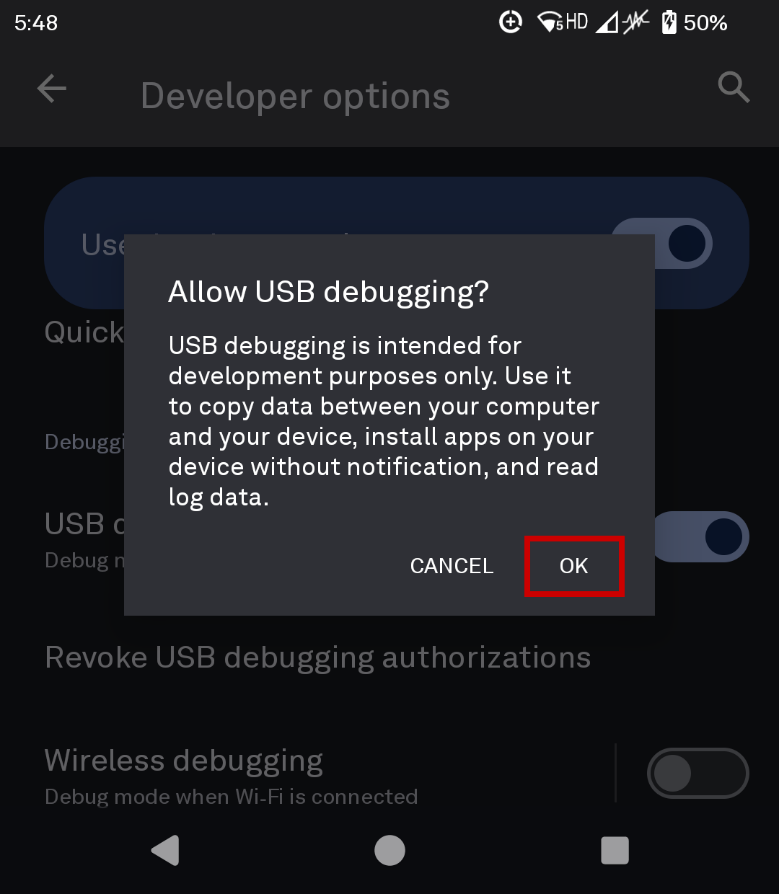

10. In the next prompt, you should see the RSA key for your computer. Select 'Allow'.

    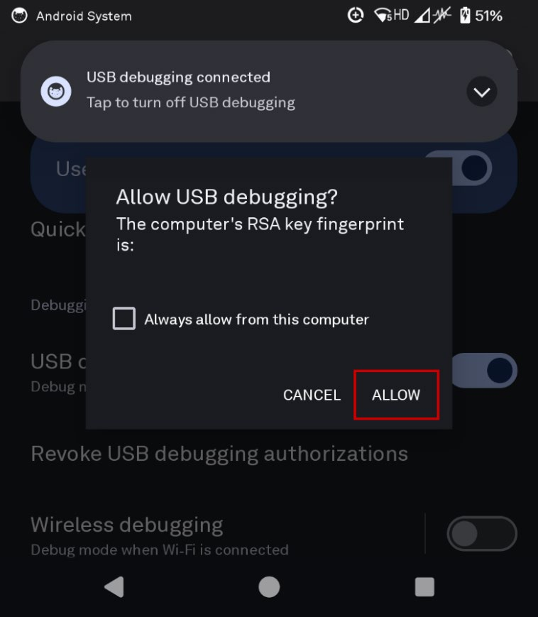



### On Computer

I'm using the standalone SDK platform tools for Windows. If you are using the SDK manager or on Linux/Apple, your screen may be different but the adb commands are the same/similar.



11. Unzip `platform-tools-latest-xxx.zip`
    a. I opted to unzip it to my C: drive under `/Program Files/`
12. Locate your unzipped platform-tools and open the folder.

    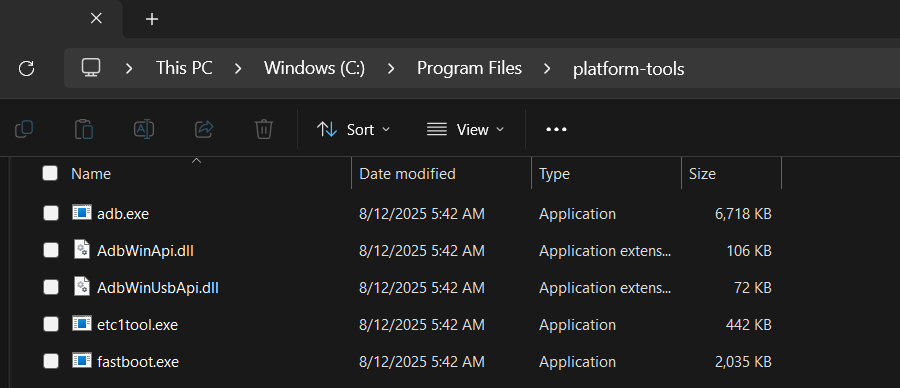

13. Right click anywhere outside of the files in the folder and select 'Open in Terminal'.

    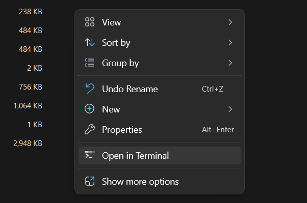

14. To test whether or not your computer recognises the Light Phone III, type the following command:

    ```
    /adb devices
    ```

    

If the device is not showing up, verify USB debugging is enabled and you allowed the computer access to the phone.

15. Running the following command will list all of the packages on the device.

    ```
    /adb shell pm list packages
    ```

    

16. We are looking for the following packages associated to LightOS:
    - `com.lightos`
    - `com.lightos.utilities`
    - `com.lightos.certmanager`
    - `com.lightos.speech`
    - `com.lightos.fota`

    

17. Now run the following commands to disable these packages:

    ```
    /adb shell pm disable-user com.lightos
    /adb shell pm disable-user com.lightos.certmanager
    /adb shell pm disable-user com.lightos.fota
    /adb shell pm disable-user com.lightos.speech
    /adb shell pm disable-user com.lightos.utilities
    ```

18. We can verify these packages by running the following command:

    ```
    /adb shell pm list packages -d
    ```

    

19. Reboot adb.

    ```
    /adb reboot
    ```

    a. This will reboot the phone.

    

20. Once completed, you can verify LightOS and its associated packages are disabled in `Settings > Apps > All Apps`
    a. If an application says 'Enable' that means it has been disabled.

    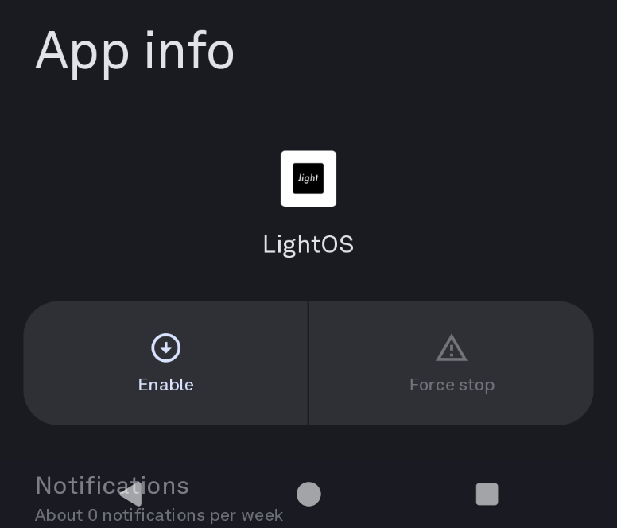



## ADB via Shizuku/aShell

Shizuku used in conjunction with aShell will allow you to run adb commands without the need for a computer. This is also used to run certain root/ADB hack commands for Key Mapper and MacroDroid.

Shizuku will act as the adb package and aShell will act as your terminal.

What you will need:

- Light Phone III
- Shizuku (via Aurora) or via browser **[HERE](https://shizuku.rikka.app/download/)**.
- aShell (via F-Droid) or via GitHub **[HERE](https://github.com/DP-Hridayan/aShellYou)**.
- Wi-Fi connection

### Shizuku



1. Open Shizuku.
2. We want to use the option 'Start via Wireless Debugging' for Android versions 11+
    a. You can find the step-by-step guide **[HERE](https://shizuku.rikka.app/guide/setup/#start-via-wireless-debugging)** for pairing.

    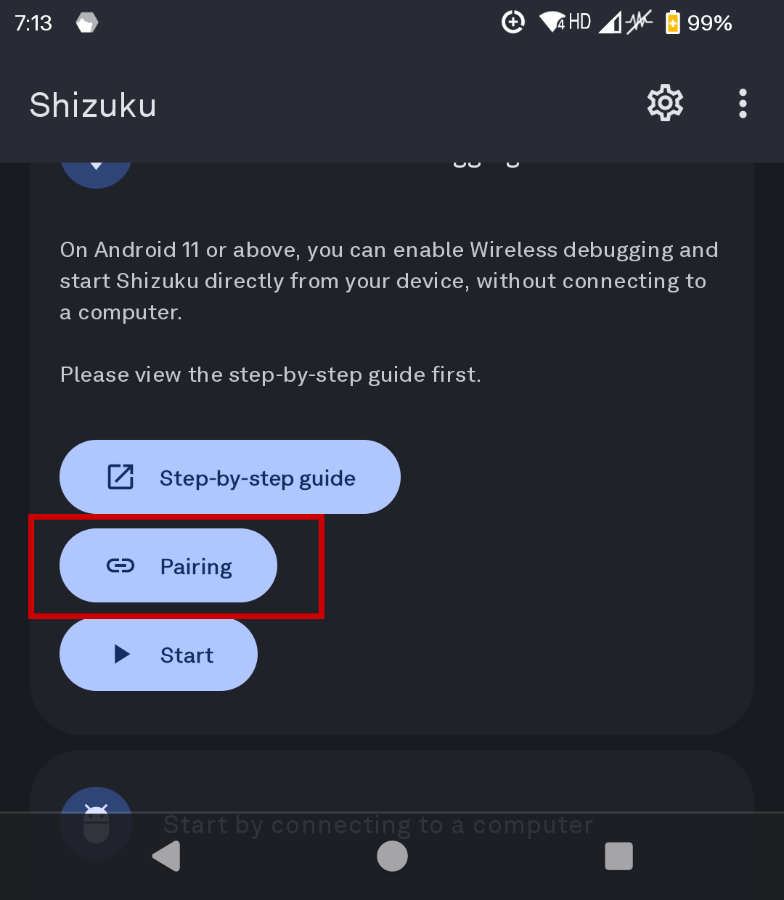

3. Once Shizuku is paired, go ahead and start Shizuku.

    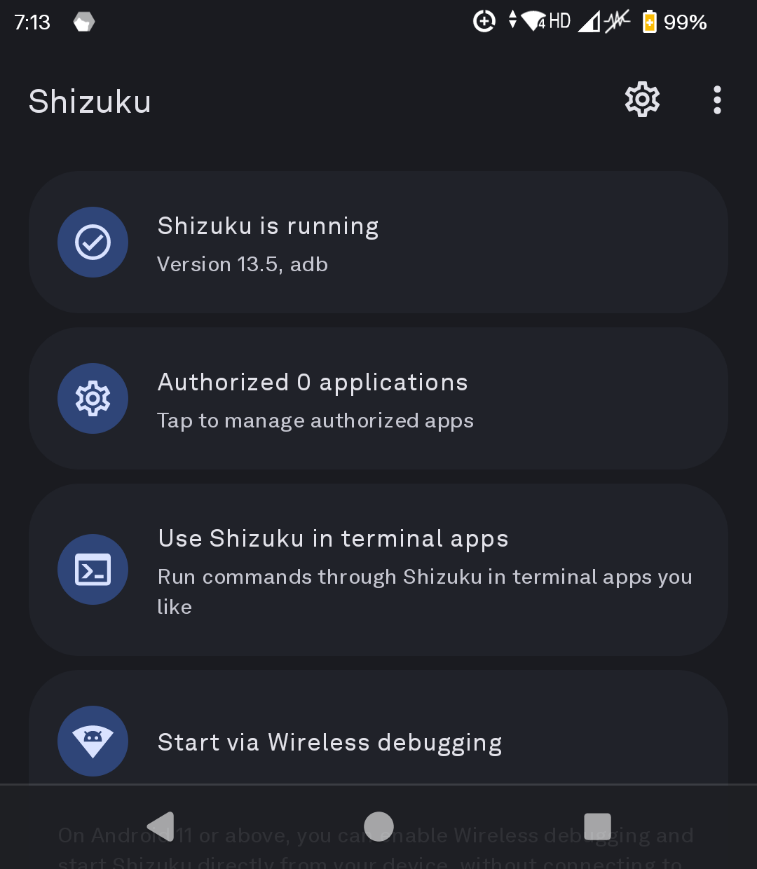

    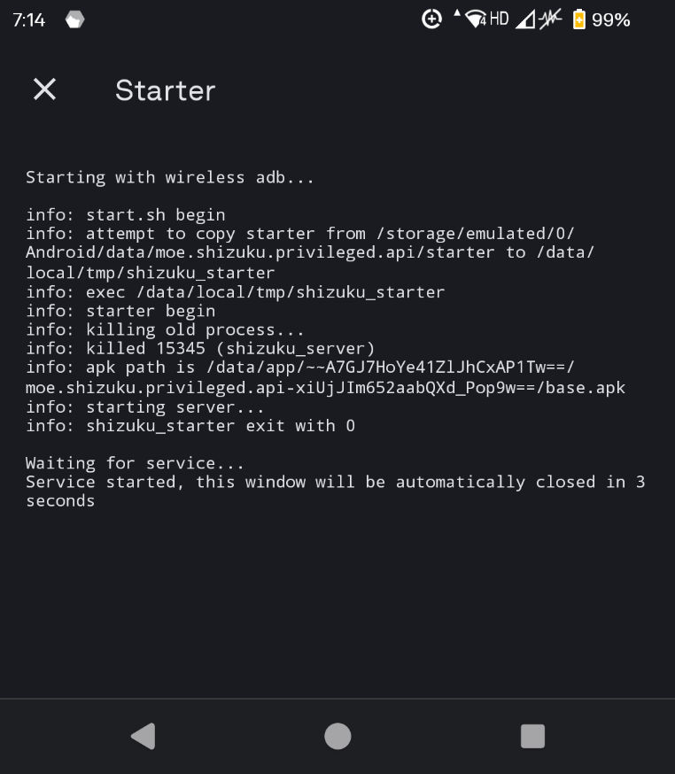



### aShell



4. Once Shizuku is running, open aShell.
5. Find the tab that says 'Permissions required' and select 'Request Permission'.

    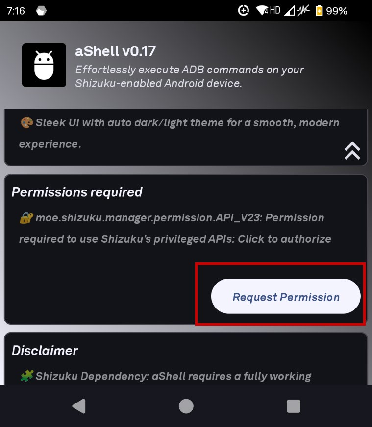

6. Allow aShell to access Shizuku.

    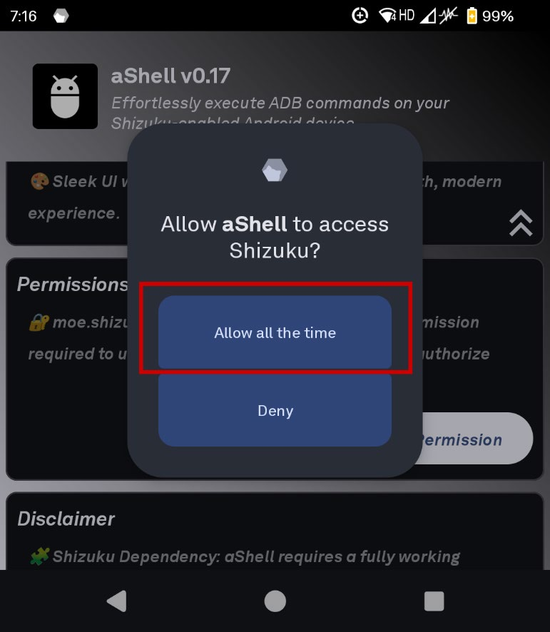

7. Now, select 'Start'.

    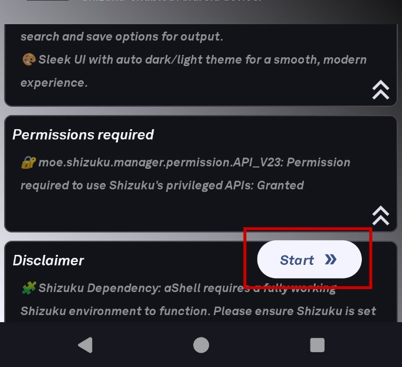

8. Here you will see a screen with a command box. You may need to hide the keyboard to fully see it.
    a. We don't have a way to test if adb recognises the device like we would on SDK.

> [!NOTE]
> Unlike SDK, we do not need to place a '/' in front of adb, the '#' at the beginning of the command box replaces the '/'.

9. Running the following command will list all of the packages on the device.

    ```
    adb shell pm list packages
    ```

    

10. We are looking for the following packages associated to LightOS:
    - `com.lightos`
    - `com.lightos.utilities`
    - `com.lightos.certmanager`
    - `com.lightos.speech`
    - `com.lightos.fota`

    

11. Now run the following commands to disable these packages:

    ```
    adb shell pm disable-user com.lightos
    adb shell pm disable-user com.lightos.certmanager
    adb shell pm disable-user com.lightos.fota
    adb shell pm disable-user com.lightos.speech
    adb shell pm disable-user com.lightos.utilities
    ```

12. Once completed, you can verify LightOS and its associated packages are disabled in `Settings > Apps > All Apps`
    a. If an application says 'Enable' that means it has been disabled.

    



# Enabling LightOS

Should you decide to enable LightOS at any point either for firmware updates or would like to go back to LightOS, you'll need to run the following commands:

```
adb shell pm enable com.lightos
adb shell pm enable com.lightos.certmanager
adb shell pm enable com.lightos.fota
adb shell pm enable com.lightos.speech
adb shell pm enable com.lightos.utilities
```

These commands can be run in SDK or Shizuku/aShell.

# Full Android without ADB

There is a workaround for you folks that want to go Full Android without the full commitment to disabling LightOS either through SDK or Shizuku/aShell. The only real way to achieve this is by going through `Settings > Apps > All Apps` and selecting 'Force Stop' on LightOS.

The 'Force Stop' should persist through reboots and will run minimally in the background. I don't recommend this option since LightOS will still be running in the background and will continue to search for updates and/or syncing if that is still enabled. There is also the possibility for random crashes and reboots to still occur with LightOS enabled but force stopped. While I don't recommend this option, I still leave it available to whomever may want it.

# Global settings: other

Since LightOS Developer Options are not accessible as of November 2025, I managed to find some additional settings that MAY be useful in restoring missing UI elements. This is due to `light_mode` not being the end-all be-all setting for restoring these settings. This includes, status bar, navigation bar, notifications, etc.

Using the previous section for `light_mode`:



1. Run the following command in adb:

    ```
    /adb shell settings put global light_mode 0
    ```

    a. Note that running the command will not output any results.

2. We can also run the following command to verify `light_mode` is 0:

    ```
    /adb shell settings get global light_mode
    ```

    a. Running any `get` command will output the current setting.

    



This will restore functionality within Full Android mode.
