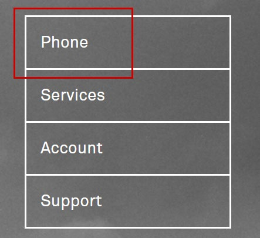
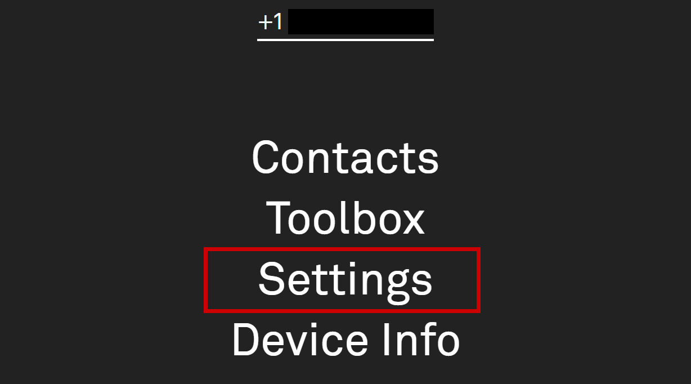
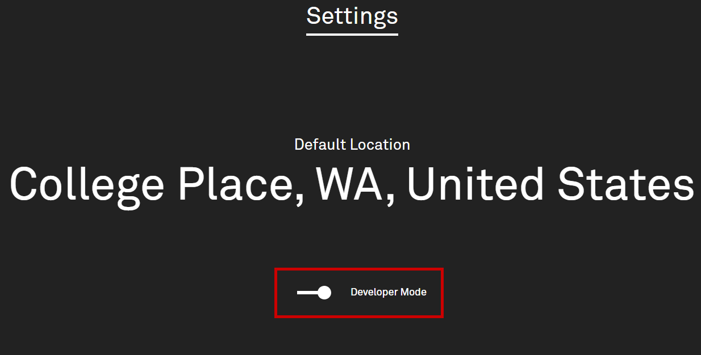
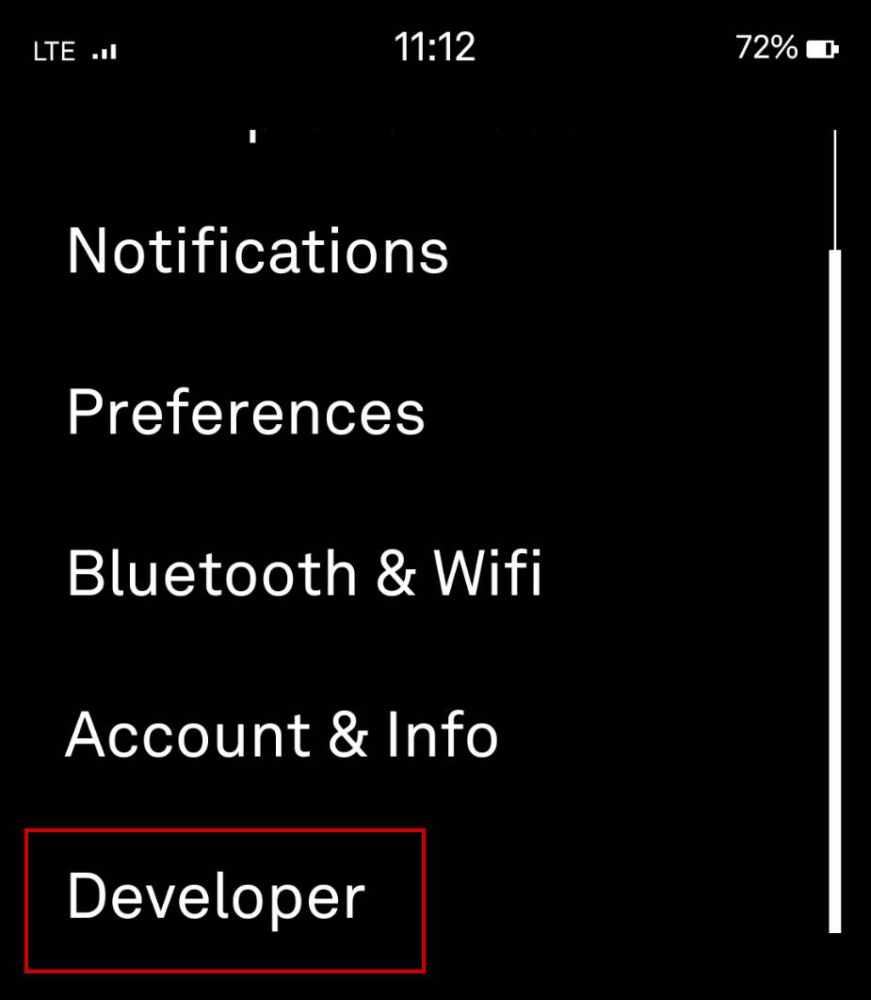
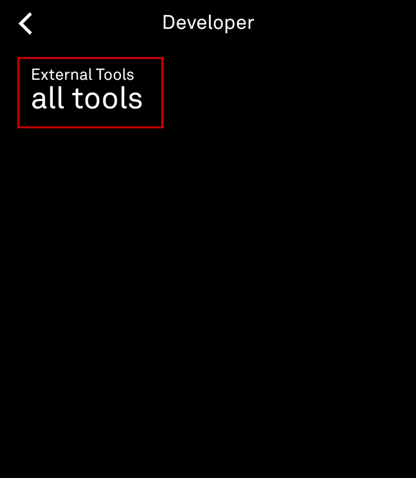
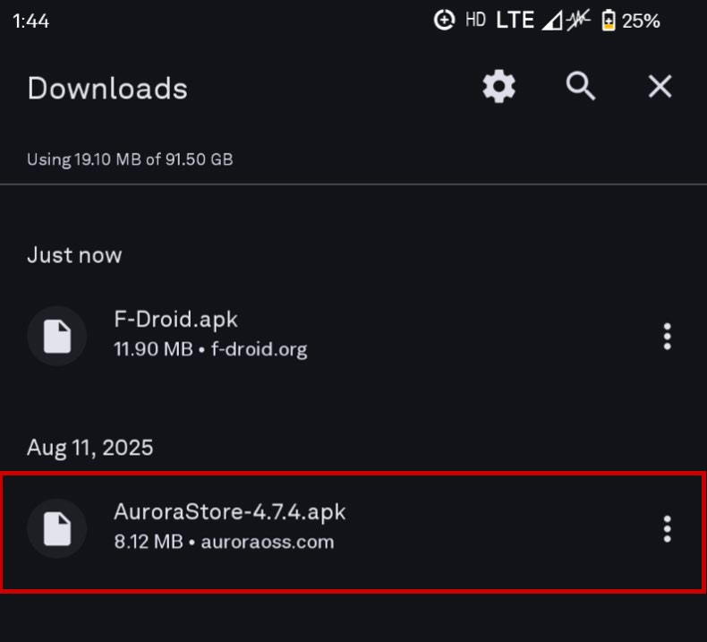
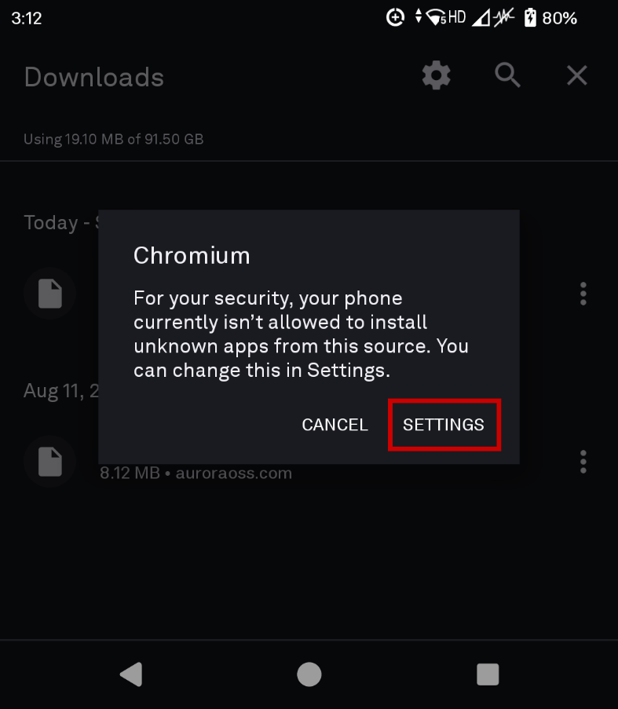
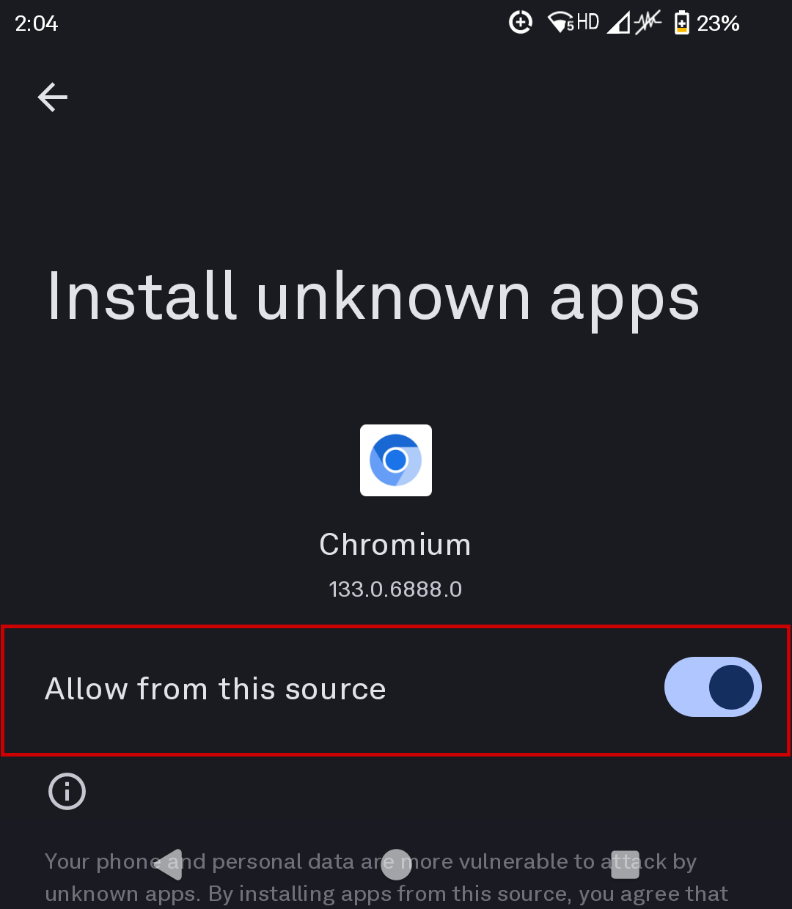
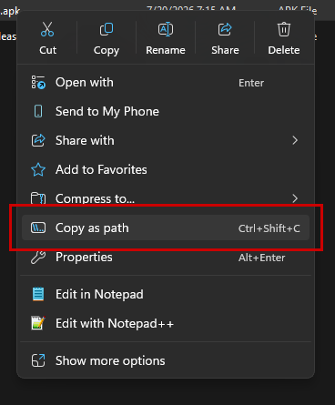
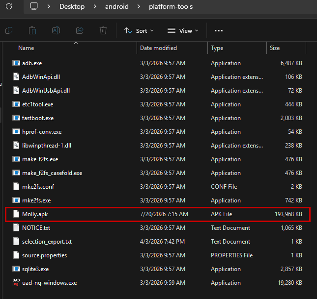

Following the release of the [Light-SDK on GitHub](https://github.com/lightphone/light-sdk), this section serves as a guide to enable additional tools within LightOS. Hybrid Mode has effectively been replaced although, should you wish to continue using or prefer Hybrid Mode, the option is still available and can be enabled here.

The software development kit (SDK) serves multiple purposes for the LP3:

- Light internal development for things like a reworked Camera tool and keyboard for optimisation and new features.
- Allowing the community to create their own dedicated Light tools for the LP3.
- Separate tools, instead of the singular LightOS .apk with individual modules.
    - Currently, all tools are modules within the single LightOS app. Unfortunately, if one thing is changed, something else may break.
    - Separating tools prevents LightOS from breaking in unexpected ways.
    - Allows secure third-party contributions.

You can read more about the SDK and what prompted the changes in the [Light Developer Program - June Update](https://us9.campaign-archive.com/?u=edd76eb62ae39ab4aea07bf69&id=1d6ec7eff3).

There are a multitude of benefits following the release of the SDK, as noted in [this release page](https://www.lightphonethings.com/):

- Design elements library
    - Open-source UI/UX library of application components built around Jetpack Compose.
    - Ensures uniformity across all tools regardless if they're made by Light or the community.
- Push notification support
    - Push notifications, if supported, will be routed through the UnifiedPush Distributor and Light's servers so notifications can populate within LightOS.
    - This includes support for external tools as well.
- Media access
    - With user permission, tools can be built around their audio, video, images and other files with encrypted APIs for sending and receiving data with LightOS.

# Tool Library

The LightOS Tool Library is a way for users to browse and use a collection of vetted, user-created tools directly from the Dashboard. These tools are ones that the community submitted and Light approved.

> [!NOTE]
> This is for users who either don't want to install external tools/apps, use only Light-approved tools or simplify the tool installation process – it's through the Dashboard, so the process will be largely the same as adding tools to your LP3 already.

The process of submitting your own tools should begin in August 2026.

[Light plans to release a tool library](https://www.reddit.com/r/LightPhone/comments/1pk4g9w/comment/ntokyjb/?screen_view_count=1) for the LP3 in September/October 2026. It was one of [the suggestions I had made to Joe back in December 2025](https://www.reddit.com/r/LightPhone/comments/1ulolc2/comment/ov6exsn/), with a [confirmation in March 2026](https://www.reddit.com/r/LightPhone/comments/1rqk4mk/comment/oa2h9kt/), prior to the SDK release. I'm both really excited for one of my suggestions to have been implemented and to see what it's like when it comes out!

New tools built with the Light SDK and available with the [v568 update](https://support.thelightphone.com/hc/en-us/articles/360031105751-Software-Versions-Change-Log) include the Weather tool and Authenticator tool. These are separate .apks and NOT included within the main LightOS app.

# For Developers

For those who wish to [create their own tools for the LP3](https://github.com/lightphone/light-sdk/tree/main/docs/system_app), the [Light-SDK on GitHub](https://github.com/lightphone/light-sdk) will walk you through the process of creating your own application source code, running it on the [LightOS Emulator](https://github.com/lightphone/light-sdk/blob/main/sdk/emulator) with instructions on how to run the emulator, and further examples of Light's newly released [Authenticator tool](https://github.com/lightphone/light-sdk/tree/main/examples/authenticator) and [Weather tool](https://github.com/lightphone/light-sdk/tree/main/examples/weather) that were released in v568. It's recommended to have familiarity with [Android Studio](https://developer.android.com/studio), as well as knowledge of Kotlin, Compose, Coroutines and MVVM architecture but is not required. If you want to vibe code your way through a tool with Claude, you're more than welcome to.

# Installing external tools

What you will need:

- Light Phone III
- Keyboard (either wired USB-C connection or wireless)
- A personal computer

## In Light Account Dashboard



1. Navigate to the [Light Phone Dashboard](https://dashboard.thelightphone.com/) and sign-in.
2. On the dashboard, select 'Phone'.

    

3. Under the selected device, select 'Settings'.

    

4. In 'Settings', verify your default location and select the toggle for 'Developer Mode'
    - This enables Developer Mode on LightOS

    



## In LightOS



1. In LightOS Settings, select 'Developer'.

    

2. Verify 'all tools' is enabled for 'External Tools'.

    



## On the Light Phone

> [!NOTE]
> You MUST be able to access the Android layer in order to install external apps/tools. Maybe Light will convert the 'Developer Mode' to allow USB debugging to be toggled in the future to allow a simplified way of installing external tools but until then, access to the Android layer is a necessity.

You will need to follow two sections detailed in this guide:

1. [How to Access the Android Layer](/resources/modding-guide/how-to-access-the-android-layer/)
2. [Android Developer Options](/resources/modding-guide/developer-options/#android)
3. [Enabling ADB / Debugging via Android SDK](/resources/modding-guide/full-android/#adb-via-android-sdk) (Steps 1-10)

## Installing applications

You can install applications a few ways:

- Via an App Store
- Default Android Package Installer
- Via ADB

All community-made tools for the LP3 are recommended to be downloaded via [Obtainium](https://github.com/ImranR98/Obtainium) as this will allow them to stay updated frequently as developers frequently push out new fixes and releases. A list of current community-made Light tools can be found **[HERE](/resources/modding-guide/applications/#community-made-light-tools)**.

### Via an App Store

In this guide, under [Applications](/resources/modding-guide/applications/), the section [Clients](/resources/modding-guide/applications/#clients) walks you through how to install [Aurora](https://auroraoss.com/files) and/or your preferred choice of FOSS/OSS app store client.

For proprietary non-FOSS applications (i.e. Discord, WhatsApp, Apple Music, Spotify, etc.) you will need the Aurora store. Aurora store is a Google Play client so anything that you would normally find on the Google Play Store will be here, however, there is no guarantee that it will work on the LP3. There is a [mega thread on r/ModifiedLightPhones](https://www.reddit.com/r/ModifiedLightPhones/comments/1qxejib/which_apps_work_on_the_light_phone_23_mega_thread/) that details some of the known applications that work on the LP3.

### Android Package Installer

.apk files are essentially .zip files read by the Android OS that contain all source code, permissions, assets, etc.

Once you have downloaded the appropriate .apk file on your LP3:



1. Tap on the .apk file.

    

2. Open the .apk with 'Package Installer'.

    

3. You may receive the following prompt saying Chromium 'isn't allowed to install unknown apps from this source.' Tap 'Settings'.

    

4. Enable Chromium to install unknown apps.

    

5. Let the app finish installing.



### Via ADB

What you will need:

- Light Phone III
- Reliable wired USB-C to USB-A or USB-C to USB-C connection
- PC with ADB via Android SDK

At this point, USB debugging should already be enabled. If it is not, please go through steps 1-14 in the section [ADB via Android SDK](/resources/modding-guide/full-android/#adb-via-android-sdk).



1. Find the application you want to install and download the .apk to your PC.

    For this example, I'll be using [jabberbox's LightOS-esque Molly (Signal) Client](https://github.com/jabberbox/molly-light) on Win11. If you're using a separate OS, the process is largely the same.

    - If the application is downloaded to a folder outside of the platform-tools folder, you will need to pull the entire and exact file path WITH the quotation marks.
        - Right-click the file and select 'Copy as path' or `Ctrl + Shift + C`. It should appear like this:

            ```
            "C:\Users\sabbath\Desktop\android\packages\comms\molly-light-1.4.apk"
            ```

            

        - Run the following command to install an application, changing `[application_filepath]` with the file path of the application you wish to install:

            ```
            /adb install "[application_filepath]"
            ```

            

    - If the application is in the platform-tools folder, you will need only the package name. Run the following command, changing `[application_filename]` with the name of the .apk:

        ```
        /adb install "[application_filename]"
        ```

        

2. You are able to change the file name of the .apk in your folder explorer. If it makes it easier to install your packages as 'Molly.apk' instead of 'molly-light-1.4.apk' you can.

    

    

3. If you are receiving errors, verify the file path or file name is correct, adb.exe is running and/or the device is seen by adb.

    Common errors include:

    - `adb.exe: no devices/emulators found` — Verify adb is authorised on the device and the device is seen by adb.
    - `adb.exe: failed to stat [filename].apk: No such file or directory` — Verify the file name or file path is correct.
    - `adb.exe: device unauthorized. This adb server's $ADB_VENDOR_KEYS is not set` — Try `adb kill-server` if that seems wrong. Otherwise check for a confirmation dialog on your device. Verify adb is authorised on the device.
    - `adb.exe: device offline` — Verify the device is on and unlocked OR verify USB connection.



# Disable / Enable Auto-Foreground

One of the additions to v568 is a change that forces LightOS to pull itself into the foreground when the device's screen is turned off. The Light developers did this so that their new tools (now separate .apks from LightOS) and external tools will match the typical tool experience: if you're already in a tool and lock the phone, when you unlock the phone, you should see the LightOS lock/home screen as default.

For those who are installing external apps, this feature _may_ disrupt your experience with non-LightOS apps/tools.

There exists a system setting called `light_force_focus_level`. This is what controls LightOS's foreground behaviour. How you want LightOS to behave when the screen is locked is up to you and how you use the device.

## Level 0 (Disabled)

This is the default setting (disabled) that forces LightOS into the foreground over ALL other .apks when the screen is locked and priorities LightOS for things like alarms, calendar notifications, etc.

Use if: you want LightOS to be open every time you unlock the device.



1. Run the following command in adb:

    ```
    /adb shell settings put system light_force_focus_level 0
    ```

    a. Note that running the command will not output any results.

2. We can also run the following command to verify `light_force_focus_level` is 0:

    ```
    /adb shell settings get system light_force_focus_level
    ```

    a. Running any `get` command will output the current setting.

    



## Level 1 (Notification Focus)

This setting forces LightOS into the foreground ONLY if there are notifications or alerts. External applications will only be open when the device is unlocked if there are no active notifications within LightOS.

Use if: you want LightOS to be open when you unlock the device IF there are notifications or alerts, i.e. alarms, calendar notification



1. Run the following command in adb:

    ```
    /adb shell settings put system light_force_focus_level 1
    ```

    a. Note that running the command will not output any results.

2. We can also run the following command to verify `light_force_focus_level` is 1:

    ```
    /adb shell settings get system light_force_focus_level
    ```

    a. Running any `get` command will output the current setting.

    



## Level 2 (App/Tool Focus)

This setting sets LightOS to behave as it did before v568. This means that LightOS will NOT force itself into the foreground unprompted. Any apps/tools that were previously open when the device was locked will stay open when the screen is turned on/unlocked.

Use if: you want your previously open app/tool to stay open when the device is unlocked.



1. Run the following command in adb:

    ```
    /adb shell settings put system light_force_focus_level 2
    ```

    a. Note that running the command will not output any results.

2. We can also run the following command to verify `light_force_focus_level` is 2:

    ```
    /adb shell settings get system light_force_focus_level
    ```

    a. Running any `get` command will output the current setting.

    


